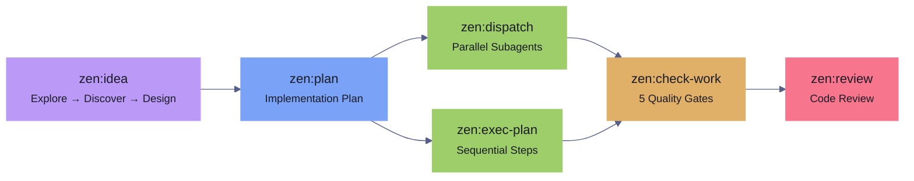
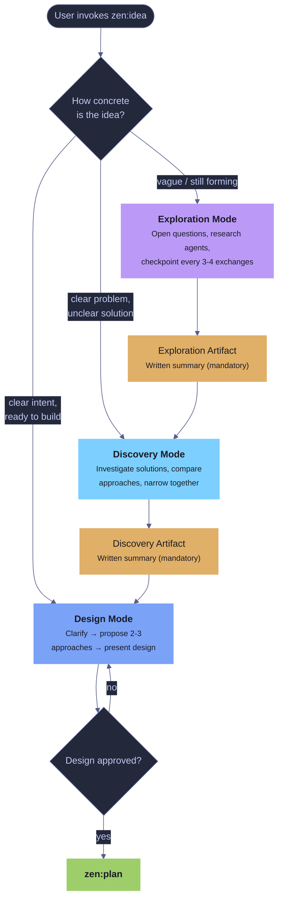
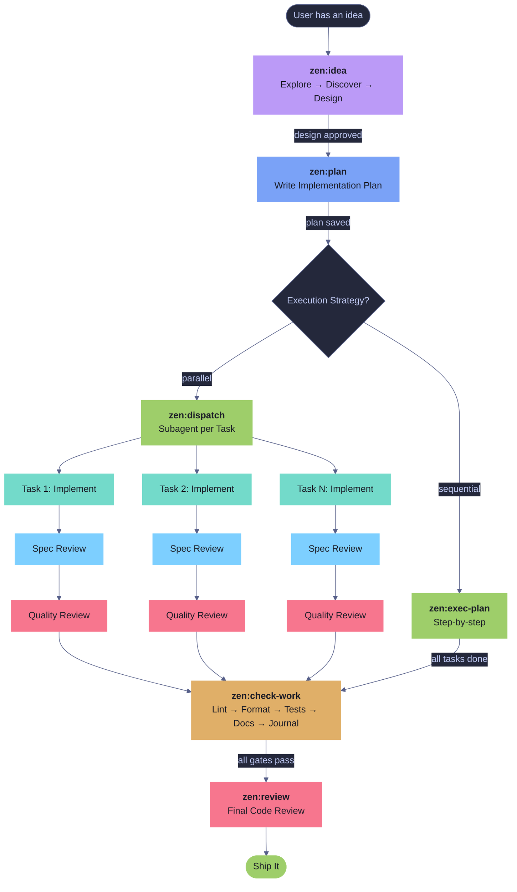
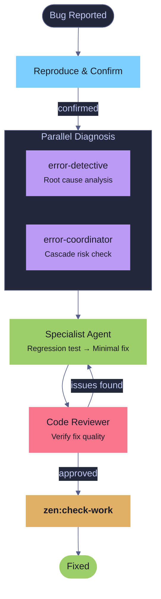
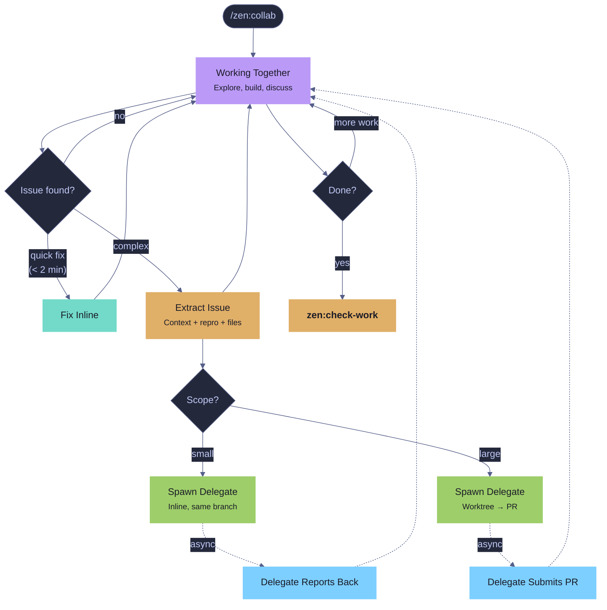
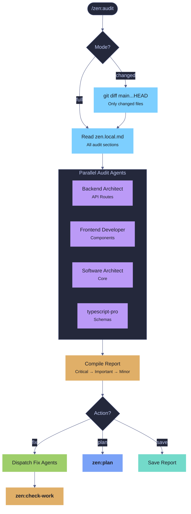

# Zen Flow

A structured development pipeline for Claude Code that turns ideas into shipped, validated code through a series of composable skills.

Zen Flow is derived from [Superpowers](https://github.com/obra/superpowers) by Jesse Vincent — a pioneering set of Claude Code skills for structured, agent-driven development. Zen Flow adapts and extends those ideas into a bundled plugin with additional skills, hooks, agents, and configuration.

## Philosophy

Every feature follows the same path: **idea → plan → execute → validate → review**. Each step has a dedicated skill with clear inputs, outputs, and quality gates. Skip a step and a hook blocks you. Follow the flow and you get consistent, high-quality results regardless of task complexity.

Zen Flow is opinionated about process but flexible about execution. You can run the full pipeline or invoke individual skills as needed.

## Installation

```bash
/plugin marketplace add ./.claude/plugins/zen-marketplace
/plugin install zen@zen
/plugin install agent-journal@zen
```

## Quick Start

Run `/zen` to see the interactive menu, or invoke any skill directly:

```
/zen:idea    Build a new user notification system
/zen:plan
/zen:dispatch
```

## The Marketplace

Two plugins, one marketplace:

| Plugin | Skills | Purpose |
|--------|--------|---------|
| **zen** | 12 skills, 1 agent, 1 command, 2 hooks | The development workflow |
| **agent-journal** | 4 skills, HTML viewer | Structured work logging |

## The Pipeline



### Full Pipeline

1. **`/zen:idea`** — Three modes based on idea maturity:
   - **Exploration** ("an idea") — open questions, research agents, periodic checkpoints. No proposals until the user signals readiness. Produces a mandatory exploration artifact.
   - **Discovery** ("a problem") — clear pain, unclear solution. Skips problem exploration, investigates solution approaches. Produces a mandatory discovery artifact.
   - **Design** ("the idea") — clear intent. Clarify → propose 2-3 approaches → present design → get approval.

   No code until the design is approved.

2. **`/zen:plan`** — Write a detailed implementation plan with bite-sized tasks, complete code in every step, exact commands, and TDD. Saved to `resources/plans/NNN-name.md`.

3. **Execute** (pick one):
   - **`/zen:dispatch`** — Parallel subagents per task with two-stage review (spec compliance + code quality). Recommended for plans with independent tasks.
   - **`/zen:exec-plan`** — Sequential execution with checkpoints. Better for tightly coupled tasks or when you want more control.

4. **`/zen:check-work`** — Five quality gates in order: lint, format, tests, docs, journal. Auto-discovers project commands from `package.json`/`CLAUDE.md`. Auto-fixes what it can, launches subagents for the rest. Enforced by a Stop hook — you cannot finish an execution session without running this.

5. **`/zen:review`** — Dispatch a code reviewer subagent with the git diff. Categorizes issues as Critical/Important/Minor with file:line references and a clear merge verdict.

### Standalone Skills

These work independently of the pipeline:

- **`/zen:collab`** — Collaborative working session (Opus model). You and the agent work together as a team — exploring code, building features, troubleshooting problems. When issues arise, they're extracted and delegated to fresh `collab-delegate` agents — either inline (quick fixes) or in **isolated worktrees** (larger issues that get their own branch and PR). Delegates load all project rules dynamically before starting work.

- **`/zen:bug-fix`** — Four-agent diagnostic pipeline: two agents diagnose in parallel (root cause + cascade risk), a specialist writes the minimal fix with a regression test, a reviewer verifies.

- **`/zen:docs`** — Create or update project documentation. Reads `.claude/zen.local.md` for doc paths, assesses what's stale, asks what to update, writes it.

- **`/zen:audit`** — Audit codebase sections against configurable code standards. Dispatches specialist agents in parallel per section, each checking against rules defined in `.claude/rules/`. Supports **changed mode** (`/zen:audit changed`) for diff-only audits — only files modified vs main get checked. Full mode for comprehensive sweeps.

- **`/zen:refactor`** — Structured refactoring pipeline. Analyzes target code, proposes changes with before/after examples, ensures regression test coverage exists, then executes. Internal API changes are allowed if all callers are updated in the same scope; external-facing changes are not refactors.

- **`/zen:status`** — Quick snapshot of project state: active plans (any frontmatter `status != complete`), task progress, git status, session history, and journal entries. Supports **recent mode** (`/zen:status recent`) which verifies tasks from the last 72h were actually completed by inspecting tests, commits, and files, then stamps plans with `validated` frontmatter.

### Agent Journal (separate plugin)

- **`/agent-journal:write`** — Append a structured entry after completing work. Captures what happened, what went wrong, and what was learned.
- **`/agent-journal:read`** — View recent entries with filtering by type, outcome, origin, branch, or keyword.
- **`/agent-journal:summary`** — Aggregate patterns across sessions — recurring blockers, hot files, health signals.
- **`/agent-journal:reflect`** — End-of-session retrospective with actionable takeaways.

Journal entries are stored in `.claude/journal.jsonl` (single file, append-only). See the [agent-journal README](plugins/agent-journal/README.md) for the full schema and HTML viewer.

## Skills Reference

| Skill | Invocation | Model | Purpose |
|-------|-----------|-------|---------|
| Menu | `/zen` | — | Interactive skill picker |
| Collab | `/zen:collab` | Opus | Collaborative session with inline + worktree delegation |
| Idea | `/zen:idea` | — | Explore → discover → design (three modes) |
| Plan | `/zen:plan` | — | Write implementation plan from spec |
| Execute (parallel) | `/zen:dispatch` | — | Subagent-per-task with two-stage review |
| Execute (sequential) | `/zen:exec-plan` | — | Step-by-step with checkpoints |
| Validate | `/zen:check-work` | — | Lint, format, tests, docs, journal gates |
| Review | `/zen:review` | — | Code review via subagent |
| Bug Fix | `/zen:bug-fix` | — | Diagnose and fix with agent pipeline |
| Docs | `/zen:docs` | — | Create or update documentation |
| Audit | `/zen:audit [changed]` | — | Audit code sections against standards; changed = diff-only |
| Refactor | `/zen:refactor` | — | Structured refactoring with regression safety |
| Status | `/zen:status [recent]` | — | Project state snapshot; recent mode verifies recent work |
| Journal Write | `/agent-journal:write` | — | Append structured journal entry |
| Journal Read | `/agent-journal:read` | — | View and filter entries |
| Journal Summary | `/agent-journal:summary` | — | Aggregate patterns and health signals |
| Journal Reflect | `/agent-journal:reflect` | — | End-of-session retrospective |

## Agents

| Agent | Model | Purpose |
|-------|-------|---------|
| `collab-delegate` | Opus | Fresh specialist spawned by zen:collab to handle extracted issues |

The collab-delegate agent:
- **Loads all project rules dynamically** — globs `.claude/rules/*.md` and reads every file, announcing each one
- **Has zen skills** — can invoke `zen:plan`, `zen:check-work`, `zen:review`, and `testing-anti-patterns`
- **Receives structured handoffs** — context, reproduction steps, relevant files, what was already tried
- **Can work in worktrees** — isolated branch, commits freely, submits PR as review gate
- **Can escalate** — reports `BLOCKED` if context is insufficient rather than guessing

## Hooks

Zen Flow includes two Stop hooks that enforce workflow discipline:

| Hook | What it does |
|------|-------------|
| `enforce-plan-mode-tools` | In plan mode, blocks ending a turn without calling `ExitPlanMode` or `AskUserQuestion` |
| `enforce-work-validation` | After `zen:exec-plan` or `zen:dispatch`, blocks finishing without running `zen:check-work` |

These fire automatically when the plugin is installed. No configuration needed.

## Configuration

All zen configuration lives in `.claude/zen.local.md` — a single file with YAML frontmatter for structured config and a markdown body for freeform notes.

### Documentation paths (zen:docs)

```yaml
---
docs:
  readme: README.md
  architecture: docs/ARCHITECTURE.md
  claude: CLAUDE.md
  changelog: CHANGELOG.md
  paths:
    - name: Guides
      dir: docs/
      glob: "*.md"
    - name: API Reference
      path: docs/api-reference.md
---

Style notes: use tables for config options, code blocks for commands.
```

**Well-known fields:** `readme`, `architecture`, `claude`, `changelog` — paths to standard files.

**`paths` array:** Additional doc locations. Each entry has a `name` and either:
- `path` — a single file
- `dir` + `glob` — a directory scanned with a glob pattern (default: `"*.md"`)

If no config exists, `zen:docs` auto-discovers common locations and creates the file for you.

### Audit sections (zen:audit)

```yaml
---
audit:
  sections:
    - name: API Routes
      dir: packages/server/src/server/routes/
      glob: "**/*.ts"
      agent: Backend Architect
      standards:
        - error-handling
        - async-patterns
    - name: Frontend Components
      dir: packages/frontend/src/components/
      glob: "**/*.tsx"
      agent: Frontend Developer
      standards:
        - react-patterns
---
```

Each `standards` entry maps to a file in `.claude/rules/` (e.g., `error-handling` → `.claude/rules/error-handling.md`). The `agent` field selects which specialist subagent type reviews that section.

If no `audit` config exists, `zen:audit` scans the project and asks you to configure it.

### Layering

- **Project-level:** `.claude/zen.local.md` — committed or gitignored per team preference
- **User-level:** `~/.claude/zen.local.md` — personal defaults across all projects
- Project config overrides user config.

## Design Principles

- **Human controls commits** — agents write code and present changes; the human decides when to commit
- **Project-agnostic** — no hardcoded toolchain; skills discover commands from `package.json`, `CLAUDE.md`, or config files
- **Mandatory artifacts** — exploration and discovery modes produce written summaries before transitioning; if the session dies, the artifact survives
- **Context protection** — collab delegates side issues to fresh agents instead of burning primary session context
- **Hooks enforce gates** — you can't skip validation, so quality is structural, not aspirational

## Plugin Structure

```
zen-marketplace/
├── .claude-plugin/
│   └── marketplace.json
├── plugins/zen/
│   ├── .claude-plugin/
│   │   └── plugin.json
│   ├── agents/
│   │   └── collab-delegate.md        # Opus-powered specialist for zen:collab
│   ├── commands/
│   │   └── zen.md                    # /zen interactive menu
│   ├── hooks/
│   │   ├── hooks.json                # Stop hook registration
│   │   └── scripts/
│   │       ├── enforce-plan-mode-tools.sh
│   │       └── enforce-work-validation.sh
│   └── skills/
│       ├── idea/SKILL.md             # zen:idea — explore → discover → design
│       ├── plan/SKILL.md             # zen:plan — write implementation plans
│       ├── exec-plan/SKILL.md        # zen:exec-plan — sequential execution
│       ├── dispatch/                  # zen:dispatch — parallel subagent execution
│       │   ├── SKILL.md
│       │   ├── implementer-prompt.md
│       │   ├── spec-reviewer-prompt.md
│       │   └── code-quality-reviewer-prompt.md
│       ├── check-work/SKILL.md       # zen:check-work — 5 quality gates
│       ├── review/                    # zen:review — code review
│       │   ├── SKILL.md
│       │   └── code-reviewer.md
│       ├── bug-fix/SKILL.md          # zen:bug-fix — diagnostic pipeline
│       ├── docs/SKILL.md             # zen:docs — documentation
│       ├── audit/SKILL.md            # zen:audit — code standards audit
│       ├── refactor/SKILL.md         # zen:refactor — structured refactoring
│       ├── status/SKILL.md           # zen:status — project snapshot + recent verify
│       └── collab/SKILL.md           # zen:collab — collaborative session (Opus)
└── plugins/agent-journal/
    ├── .claude-plugin/
    │   └── plugin.json
    ├── scripts/
    │   └── journal.html              # Browser-based viewer (Tokyo Night)
    └── skills/
        ├── write/SKILL.md            # agent-journal:write
        ├── read/SKILL.md             # agent-journal:read
        ├── summary/SKILL.md          # agent-journal:summary
        └── reflect/SKILL.md          # agent-journal:reflect
```

## Workflow Diagrams

### zen:idea — Three Modes



### Full Pipeline Flow



### Bug Fix Pipeline



### Collab Session Flow



### Audit Flow



## Workflow Examples

### New Feature (full pipeline)

```
You: /zen:idea  I want to improve how agents communicate results
  → "How concrete is this? Still forming, clear problem, or ready to design?"

You: Still forming — I know there's a problem but I'm not sure what to build
  → [Exploration mode: open questions, research agents investigate
     current communication patterns, checkpoint findings]
  → Exploration artifact produced

  → "This is getting concrete — ready to move into discovery?"
You: Yes
  → [Discovery mode: investigates 3 approaches — structured reports,
     streaming events, journal integration]
  → Discovery artifact produced: leading candidate is journal integration

  → "Ready to design?"
You: Yes, let's go with journal integration
  → [Design mode: clarifies schema, proposes architecture, presents design]
  → Design approved

You: /zen:plan
  → Plan saved to resources/plans/245-agent-communication.md

You: Subagent-Driven
  → /zen:dispatch executes 5 tasks with parallel subagents
  → Each task: implement → spec review → code quality review
  → /zen:check-work runs all 5 gates
  → Done
```

### Collab Session (inline delegation)

```
You: /zen:collab  Let's work on the notification system together
  → Starting collab session (Opus). Working on notifications together.

You: Let's start by looking at how SSE works in the server
  → [Reads SSE handler together, discusses architecture]
  → "The stream handler looks clean but I notice the rate limiter
     has a bug — it's not resetting the counter. Want to fix it
     inline or delegate?"

You: Delegate it, let's stay focused on notifications
  → [Extracts issue with context, reproduction steps, files involved]
  → [Spawns collab-delegate agent with full handoff]
  → Delegate:
      Loading project context...
        ✓ CLAUDE.md
      Loading .claude/rules/ ...
        ✓ error-handling.md
        ✓ async-patterns.md
        ✓ ... (all rules)
      Rules loaded: 13 files. Ready to work.
      [Writes regression test, fixes rate limiter]
  → "Rate limiter fix is in — added counter reset in middleware.
     Back to notifications..."
```

### Collab Session (worktree delegation)

```
You: /zen:collab  Let's explore the plugin system together
  → Starting collab session (Opus). Exploring plugins together.

You: I think the plugin loader needs a complete rewrite
  → [Reads plugin loader, discusses problems together]
  → "This is bigger than a side fix — 6 files involved, needs a plan.
     Want me to delegate this to a worktree so we can keep exploring?"

You: Yes, fire and forget — we'll review the PR later
  → [Extracts issue with full context and architectural notes]
  → [Spawns collab-delegate in isolated worktree]
  → "Delegate is working on its own branch. It'll plan the rewrite,
     implement it, and submit a PR. We'll review when it's ready.
     Back to exploring — what else did you want to look at?"

  → ... (20 minutes later, delegate finishes)
  → "The plugin loader PR is up: #247 — rewrites loader with
     lazy initialization, adds 12 tests. Review it when you're ready."

You: We'll look at it after we finish here
  → [Continues working, PR waiting for review]
```

### Bug Fix

```
You: /zen:bug-fix  SSE connections drop after 30 seconds
  → Reproduces the bug
  → Launches error-detective + error-coordinator in parallel
  → Detective: keep-alive interval missing in stream handler
  → Coordinator: no cascade risk, isolated to SSE module
  → Specialist writes regression test + minimal fix
  → Code reviewer approves
  → /zen:check-work validates
```

### Code Audit (full)

```
You: /zen:audit
  → Reads audit config from .claude/zen.local.md
  → Dispatches 4 specialist agents in parallel:
    Backend Architect → API Routes (12 files, 3 standards)
    Frontend Developer → Components (8 files, 1 standard)
    Software Architect → Core Orchestration (15 files, 4 standards)
    typescript-pro → Type Schemas (14 files, 2 standards)
  → Report: 49 files audited, 7 findings (1 Critical, 3 Important, 3 Minor)
  → "How should we handle findings?" → Fix Critical + Important
  → Dispatches fix agents, runs zen:check-work
```

### Code Audit (changed files only)

```
You: /zen:audit changed
  → Runs git diff --name-only main...HEAD
  → 6 files changed: 3 in routes/, 2 in components/, 1 in types/
  → Maps to 3 audit sections (skips Core Orchestration — no changes there)
  → Dispatches 3 agents (not 4 — only affected sections):
    Backend Architect → API Routes (3 files)
    Frontend Developer → Components (2 files)
    typescript-pro → Type Schemas (1 file)
  → Report: 6 files audited, 2 findings (0 Critical, 1 Important, 1 Minor)
  → Fast — finished in under a minute
```

### Refactor (internal API change)

```
You: /zen:refactor  triageIssue has 5 positional params, should be options object
  → Reads triageIssue and all 8 call sites
  → "This changes an internal function signature. All 8 callers are in this repo
     — no external consumers. This qualifies as an internal API refactor."
  → Proposes:
    Before: triageIssue(issueId, config, provider, db, sessionId)
    After:  triageIssue({ issueId, config, provider, db, sessionId })
  → Shows before/after for each of the 8 call sites
  → You approve
  → Writes characterization tests, updates signature + all callers, tests pass
  → zen:check-work validates
```

### Refactor (module split)

```
You: /zen:refactor  packages/core/src/core/triage.ts is getting unwieldy
  → Reads triage.ts and all callers/callees
  → Identifies: 3 responsibilities mixed in one file, 2 duplicated patterns
  → Proposes split into triage-interview.ts + triage-classifier.ts + triage.ts
  → Shows before/after for each extraction
  → You approve
  → Writes characterization tests, executes split, all tests pass
  → zen:check-work validates
```

### Recent Work Verification

```
You: /zen:status recent
  → Recent Verification: 245-realtime-notifications.md

  Task 1: SSE Event Schema — done
    ✓ packages/core/src/types/schema/sse-events.ts exists
    ✓ SSEEventSchema exported
    ✓ tests/unit/types/sse-events.test.ts — 4/4 passing

  Task 2: Stream Handler — partial
    ✓ packages/server/src/server/routes/sse.ts exists
    ✗ Missing: reconnection logic (described in step 4)
    ✓ tests/unit/routes/sse.test.ts — 3/3 passing

  Task 3: Client Subscriber — missing
    ✗ packages/frontend/src/lib/sse-client.ts does not exist

  Summary: 1 done, 1 partial, 1 missing
  → Updated frontmatter: validated: 2026-03-27, status: in-progress
```

### Documentation Update

```
You: /zen:docs
  → Reads .claude/zen.local.md for doc paths
  → Scans docs/, finds 3 stale guides
  → "Which docs should I update?" → Guides + README
  → Updates with current behavior
```

### Quick Status Check

```
You: /zen:status
  → Branch: feature/notifications (3 ahead, 2 uncommitted)
  → Active plan: 245-realtime-notifications.md (3/5 tasks, 60%)
  → Session: zen:dispatch in progress, zen:check-work not yet invoked
  → Last journal: worked on SSE system, blocker on rate limiting
```

### Session Reflection

```
You: /agent-journal:reflect
  → Session Timeline:
    10:15 — Started zen:collab, exploring SSE
    10:30 — Delegated rate limiter bug to worktree
    10:45 — Designed notification schema
    11:00 — Created plan, started zen:dispatch
    12:30 — All tasks complete, check-work passed

  → What Went Well:
    Worktree delegation kept context clean
    Two-stage review caught reconnection gap

  → Suggested Actions:
    - [ ] Add SSE keep-alive docs to ARCHITECTURE.md
    - [ ] Add timing test conventions to testing rules

  → "Any of these worth doing now?"
```
