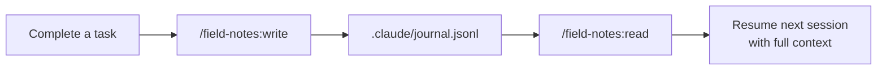
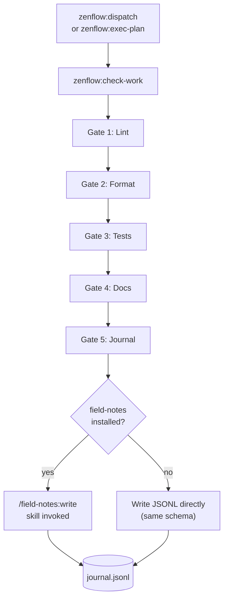
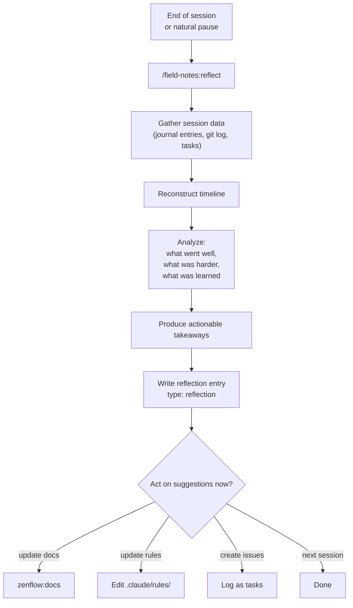
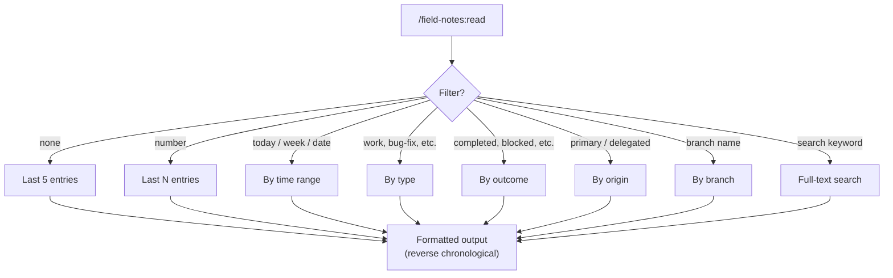
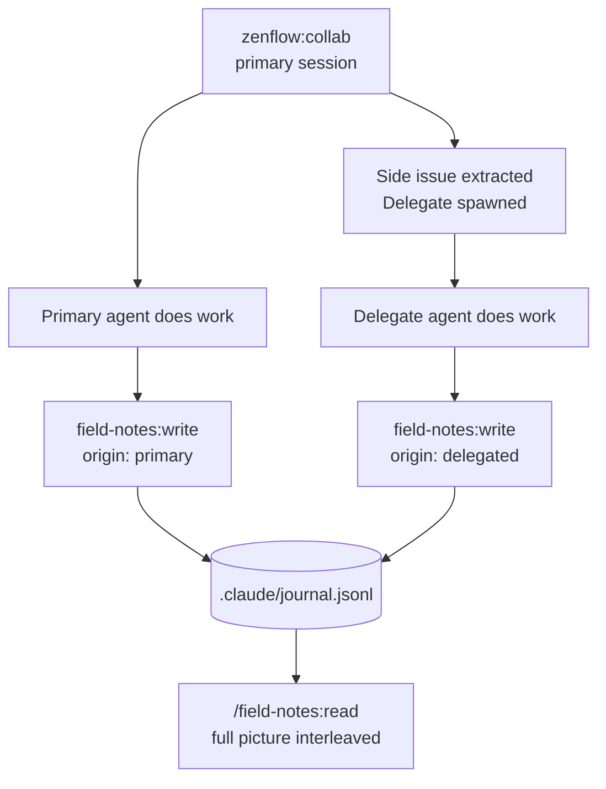
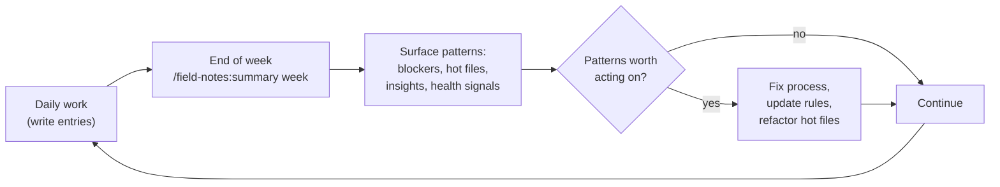

# Workflows & Diagrams

Common usage patterns for Field Notes, from quick manual entries to full session retrospectives and zenflow pipeline integration.

## Basic Entry Cycle

The simplest loop: write an entry after work, read it when resuming.

```
/field-notes:write    After completing a task
/field-notes:read     When resuming — see what was done last
```

**Example:**

```
You: /field-notes:write

Agent: Writing a field notes entry.
       What did you work on? → Refactored the auth middleware to use JWT refresh tokens
       Outcome? → completed
       Any blockers or insights? → Discovered Bun's crypto API differs from Node's

Entry written to .claude/journal.jsonl

---

You: /field-notes:read

◆ 2026-04-04 10:30 | refactor | completed | primary
  Branch: feature/auth-refresh
  Worked on: Refactored auth middleware to use JWT refresh tokens
  Discovered Bun's crypto API differs from Node's — check docs before using
  ───
```

---

## End-of-Session Retrospective

Use `reflect` at natural stopping points to extract learnings and write a structured summary.

```
/field-notes:reflect    Before ending a long session
```

**Example:**

```
You: /field-notes:reflect

Agent: Reflecting on this session.

Session Timeline:
  09:00 — Started zenflow:collab, exploring auth refresh
  09:30 — Designed JWT schema, got approval
  10:00 — zenflow:dispatch: 3 tasks to parallel subagents
  11:15 — All tasks complete, check-work passed
  11:30 — Discovered Bun crypto gap, filed note

What Went Well:
  Parallel dispatch kept tasks clean — no cross-contamination
  Crypto gap caught before it hit tests

Suggested Actions:
  - [ ] Add Bun crypto quirks to CLAUDE.md
  - [ ] Update auth module docs with refresh token flow

"Any of these worth doing now?"
```

---

## zenflow Pipeline Integration

Field Notes is invoked automatically by `zenflow:check-work` at Gate 5. No manual step needed during the pipeline.

```
/zenflow:dispatch     Execute implementation tasks
/zenflow:check-work   Gate 5 auto-invokes field-notes:write
```

**Example:**

```
You: /zenflow:check-work

Gate 1 — Lint:     ✓ passed
Gate 2 — Format:   ✓ passed
Gate 3 — Tests:    ✓ passed (84 tests, +8 new)
Gate 4 — Docs:     ✓ updated ARCHITECTURE.md
Gate 5 — Journal:  Writing field notes entry...
                   ✓ entry written

All gates passed.
```

If `field-notes` is not installed, `check-work` falls back to writing directly to `.claude/journal.jsonl` using the same schema.

---

## Filtering Entries

Narrow results by time, type, outcome, origin, branch, or keyword.

```
/field-notes:read today              # Today's entries
/field-notes:read blocked            # What's stuck
/field-notes:read bug-fix            # Bug fix entries only
/field-notes:read delegated          # Subagent entries only
/field-notes:read branch feature/x   # Specific branch
/field-notes:read search "rate limiter"  # Keyword search
```

**Example — resuming after a break:**

```
You: /field-notes:read today

◆ 2026-04-04 11:30 | refactor | completed | primary
  Branch: feature/auth-refresh | Skill: zenflow:dispatch
  Worked on: JWT refresh token middleware
  All 3 tasks complete — auth flow is clean
  Insight: Bun crypto differs from Node's — use Web Crypto API

◆ 2026-04-04 09:00 | exploration | partial | primary
  Branch: feature/auth-refresh | Skill: zenflow:collab
  Worked on: Auth refresh strategy exploration
  Designed JWT schema, pending implementation
  Would do differently: Read Bun docs first, not after

(2 entries shown, 14 total)
```

---

## Primary and Delegated Entries

When `zenflow:collab` delegates work to subagents, those agents write entries with `origin: "delegated"`. This lets you see the full picture — both your work and your delegates' work.

```
/field-notes:read delegated     # What your subagents did
/field-notes:read primary       # What you did directly
/field-notes:read              # Everything, interleaved
```

**Example — reviewing a collab session:**

```
You: /field-notes:read 5

◆ 2026-04-04 12:00 | work | completed | primary
  Branch: feature/notifications | Skill: zenflow:collab
  Worked on: SSE notification schema design
  Schema finalized — ready for implementation

◆ 2026-04-04 11:45 | bug-fix | completed | delegated
  Branch: fix/rate-limiter | Skill: zenflow:bug-fix
  Worked on: Rate limiter counter not resetting between windows
  Fixed — regression test added
  Note: counter was reset on window open instead of window close

◆ 2026-04-04 11:30 | work | partial | delegated
  Branch: feature/notifications | Skill: zenflow:dispatch
  Worked on: SSE connection handler
  Task 3 partial — reconnection logic needs another pass

◆ 2026-04-04 11:00 | work | completed | delegated
  Branch: feature/notifications | Skill: zenflow:dispatch
  Worked on: SSE route setup and keep-alive
  Files: 2 modified, 1 created | Tests: +4

◆ 2026-04-04 10:30 | exploration | completed | primary
  Branch: feature/notifications | Skill: zenflow:collab
  Worked on: Mastra SSE integration patterns
  Mastra step() API changed in 0.5 — use @mastra/core@0.4 for now
```

---

## Weekly Health Summary

Use `summary` to surface patterns across sessions — what's going wrong, what's working, where time is going.

```
/field-notes:summary          # Last 7 days
/field-notes:summary month    # Last 30 days
/field-notes:summary all      # Everything
```

**Example:**

```
You: /field-notes:summary week

## Field Notes Summary — last 7 days (23 entries)

### Activity
  work:        12 entries
  bug-fix:      4 entries
  exploration:  4 entries
  refactor:     2 entries
  reflection:   1 entry

### Hot Files
  1. src/middleware/auth.ts (6 entries)
  2. src/routes/sse.ts (4 entries)
  3. src/lib/rate-limiter.ts (3 entries)

### Recurring Blockers
  - "Bun crypto API differs from Node" (2×, partially resolved)
  - "SSE reconnect timing flaky in tests" (2×, unresolved)

### Top Insights
  - Web Crypto API works in Bun where node:crypto doesn't (3 mentions)
  - Two-stage review catches spec gaps before test failures (2 mentions)

### Health
  Bug-fix ratio:          17% — healthy (< 25%)
  Workaround ratio:        9% — healthy (< 15%)
  Blocker-free sessions:  78%
```

---

## Browser Viewer

Open the journal in a browser for full-text search and filter chips without any server.

```bash
/field-notes:view
```

Or directly from the terminal:

```bash
xdg-open "file://$(realpath plugins/field-notes/scripts/journal.html)#$(base64 -w0 .claude/journal.jsonl)"
```

The viewer shows all entries with a Tokyo Night theme, filter chips for type/outcome/origin, and a stats bar. Useful for sharing a session log with teammates or reviewing a project's full history.

---

## Flow Diagrams

### Basic Write / Read Cycle



### zenflow Pipeline Integration



### Session Retrospective



### Filtering and Discovery



### Primary vs. Delegated Entries



### Weekly Health Cadence


