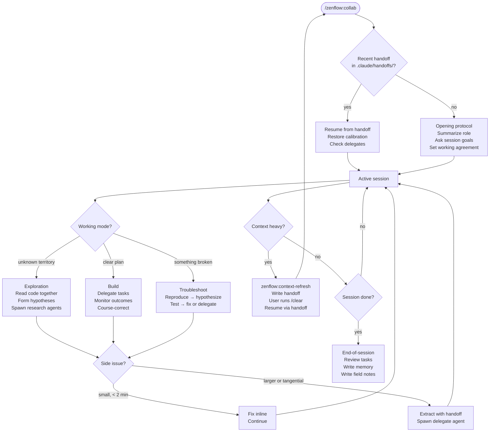
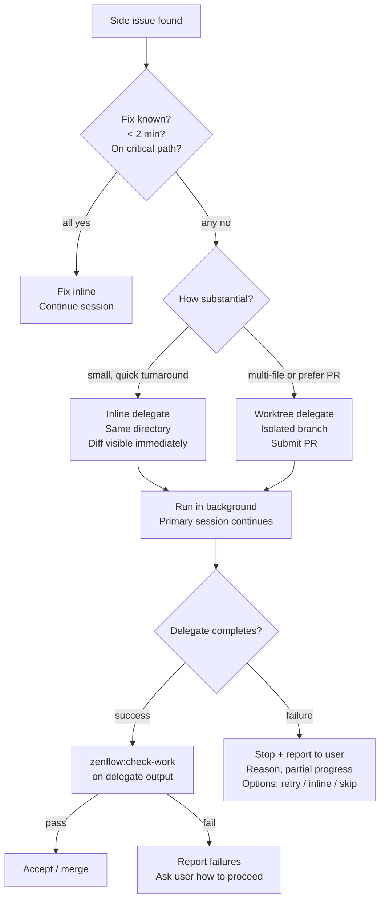
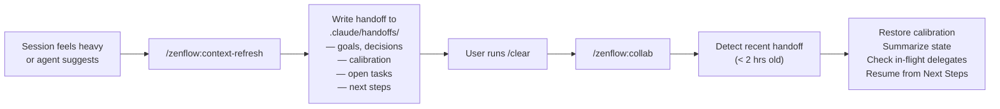
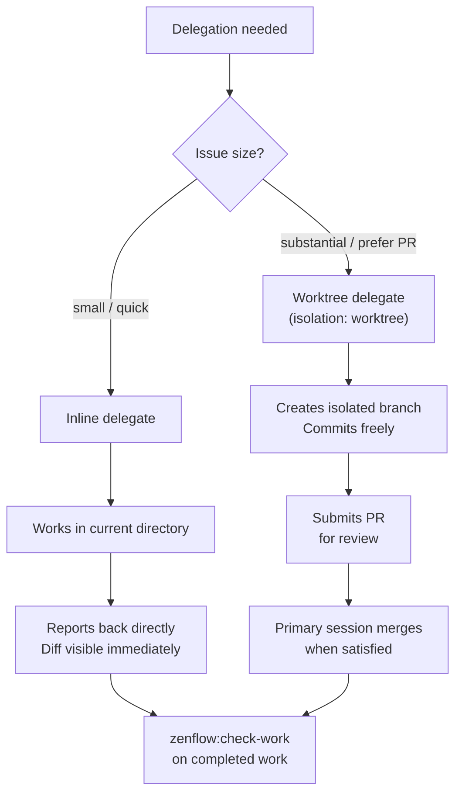

# Collab

`/zenflow:collab` is the crown jewel of ZenFlow. It opens a long-running collaborative session powered by Claude Opus — not a task executor, but a thinking partner. You explore, reason, and decide together. When it's time to build, the agent writes a clear handoff and delegates to a subagent, keeping the primary session clean.

> **Model:** Opus. Collab runs on the most capable model because the value is in reasoning quality, not execution speed.

## The Philosophy

> For the full philosophy behind zenflow, see [Philosophy](/plugins/zenflow/philosophy). For the agent's collaboration principles, see [Philosophy (Agent)](/plugins/zenflow/philosophy-agent).

Most AI interactions are one-shot: you give a task, the agent executes, the context is gone. Collab is the opposite — an extended partnership that compounds over time. The shared context you build together is the asset.

The agent's role in collab is **strategist, not executor**. It explores, challenges, and surfaces decisions. It does not write code directly. When implementation is needed, it writes a clear handoff and delegates to a fresh subagent. This keeps the primary session focused and the context clean.

What this means in practice:
- **Think with you, not for you** — the agent shares reasoning, trade-offs, and uncertainty
- **Protect session context** — every file read, every debug detour is context that can't be reclaimed
- **Delegate aggressively** — any issue that would eat context gets extracted and handed off
- **Never act unilaterally** — implementation decisions are surfaced, not made silently

## Opening a Session

```
/zenflow:collab
```

The agent does not use a canned opener. Instead, it:

1. Summarizes in its own words what this session is about and its role
2. Acknowledges that this is an extended session — context builds over time
3. Asks what you're working toward today (open-ended, partnership framing)
4. Sets the working agreement — if it drifts into execution mode, call it out

If a recent handoff file exists in `.claude/handoffs/` (from a context refresh), the agent detects it automatically and resumes from there instead.

## Three Working Modes

### Exploration Mode

For open-ended investigation — understanding unfamiliar code, diagnosing performance problems, mapping a system you don't fully know yet.

```
You and the agent read code together
→ discuss what you see
→ form hypotheses
→ test them
→ refine understanding
→ arrive at a plan or decision
```

Research agents are spawned for deep dives rather than burning primary session context reading 20 files.

### Build Mode

For feature work when you know what to build. The agent stays in the strategist role — discussing approach, writing handoffs, monitoring delegates.

```
Discuss approach
→ agree on plan
→ agent writes a clear handoff
→ delegate to subagent (or zenflow:dispatch)
→ monitor results
→ course-correct based on outcomes
→ zenflow:check-work at the end
```

### Troubleshoot Mode

For bugs, test failures, or unexpected behavior.

```
Reproduce
→ form hypothesis
→ test it
→ if confirmed: fix inline or delegate
→ if not: next hypothesis
→ if stuck after ~5 min: delegate the whole investigation
```

## Delegation

When a side issue comes up, the agent makes a quick call: handle it inline or extract it.

**Inline** — for fixes that take under 2 minutes and are directly related to the current work. The agent fixes it in the primary session and continues.

**Delegate** — for everything else. The agent extracts the issue with a structured handoff and spawns a fresh subagent to handle it.

### What Goes in a Delegate Handoff

```markdown
## Issue: [Brief title]

**Context:** What we were doing when we found this

**Problem:** What's wrong — error, unexpected behavior, failing test

**Reproduction:**
Exact steps or commands to reproduce

**Relevant files:**
- path/to/file.ts:42 — what's relevant

**What we know so far:**
- Any diagnosis already done
- Hypotheses formed

**What we tried:**
- Anything attempted before delegating

**Expected outcome:**
What "fixed" looks like
```

### Inline vs. Worktree Delegation

| | Inline | Worktree |
|---|---|---|
| Isolation | Same working directory | Isolated git worktree |
| Branch | Current branch | New branch |
| Review | Diff visible immediately | PR-based review |
| Best for | Small focused fixes | Multi-file changes, parallel work |

**When to use worktree:** the issue is substantial, you don't want to block on it, or you prefer a PR as the review gate. The worktree delegate commits freely on its own branch, submits a PR when done, and the worktree is cleaned up automatically.

### Delegation Triggers

Delegate when:
- The issue requires reading 5+ files to understand (context cost too high)
- It's tangential — not on the critical path
- You've spent more than ~5 minutes diagnosing without clear progress
- The fix is clear but mechanical (lint, test updates)
- It needs a specialist (security, performance, database)

Don't delegate when:
- The fix is 2 lines and you already know the answer
- It's blocking the next step and would take longer to context-switch
- The user wants to understand the issue — work through it together

## Context Refresh

Long sessions accumulate dead context — old file reads, debug output, stale diffs. Rather than fighting diminishing quality, do a context refresh: write a structured handoff, clear the slate, and resume cleanly.

```
/zenflow:context-refresh
```

The agent writes a handoff document to `.claude/handoffs/` capturing:
- Session goals and what was accomplished
- Active decisions and architectural constraints
- Behavioral calibration — how this user works, what corrections were given
- Open tasks and in-flight delegates
- Next steps

After the handoff is written:

```
You: /clear
You: /zenflow:collab
```

The next session detects the handoff and resumes from "Next Steps" without re-exploring accomplished work. The behavioral calibration section ensures the partnership dynamics carry through the reset.

**The agent will never clear unilaterally.** It suggests, you decide.

## End of Session

Before closing:

1. Review all open tasks — keep, discard, or mark `[LATER]`
2. Write open items to a memory file so the next session can pick them up
3. Write a field notes entry — what was done, what's still open, what was learned
4. Ask if anything else needs capturing

Nothing falls through the cracks between sessions. The journal records history; memory carries forward the open threads.

## Hard Rules

These are absolute — not guidelines.

- **Never do delegated work yourself.** If delegation fails, stop and report. Do not implement files designated for a delegate.
- **Never make direct file edits without asking.** If you need to write code beyond a quick inline fix: "Should I do this inline or delegate it?"
- **Always report delegation failures immediately** — which agent, why, what it was working on, what to do next.
- **Always run `zenflow:check-work`** on completed delegate work before accepting it.
- **Always tell the user** when extracting an issue for delegation.
- **Always include reproduction steps** in every delegate handoff.
- **Always note what was already tried** so the delegate doesn't repeat it.

## When a Delegate Fails

1. Stop current work
2. Report: agent description, failure reason, what it was working on, any partial progress
3. Ask the user: retry, handle inline, or skip
4. Never silently take over the failed delegate's work

**Permission errors:** Plugin agents cannot override Claude Code permission settings. If a delegate is denied Write or Bash access, the fix is to copy the `collab-delegate` agent to `.claude/agents/` — the agent will propose this. It's a one-time setup per project.

---

## Workflows

### Exploration Session

Starting from scratch, reading code together before any plan exists.

```
You: /zenflow:collab
     We need to add real-time notifications. Not sure of the approach yet.

Agent: Let's map what we have before proposing anything.
       I'll spawn a research agent to read the current event system.

[Research agent reads src/events/, src/routes/sse.ts, reports back]

Agent: The existing event bus is synchronous — SSE would need an async
       adapter. Three approaches worth comparing: pure SSE, WebSocket,
       or a hybrid. Want to work through the trade-offs?

You: Yeah, let's look at the trade-offs.

[Discussion, narrowing toward SSE]

Agent: We have enough to write a design. Want me to invoke zenflow:idea
       in design mode, or are you ready to go straight to a plan?
```

### Build Session with Inline Delegation

Feature work with a small bug discovered mid-session.

```
You: /zenflow:collab
     Continuing from the notifications plan — ready to execute.

Agent: Got it. The plan has 4 tasks. I'll delegate tasks 1-3 in parallel
       and monitor. Task 4 depends on 1 and 2, so we'll wait.

[Delegates tasks 1-3 to background agents]

Agent: Task 2 agent hit a snag — the SSE route is missing a keep-alive
       header. That's a 2-line fix, I'll handle it inline.

[Fixes inline, continues]

Agent: Tasks 1 and 3 complete. Task 2 complete with the keep-alive fix.
       Running check-work on the combined diff before starting task 4.
```

### Build Session with Worktree Delegation

Side bug found during feature work — isolated to its own branch.

```
You: /zenflow:collab
     Working on the notification schema. Found a rate limiter bug
     in the background — counter not resetting between windows.

Agent: That's not on our critical path. I'll delegate it to a worktree
       agent — it'll get its own branch and PR so we don't block.

[Worktree delegate spawned in background]

Agent: Delegate is running on branch fix/rate-limiter-reset.
       Back to the notification schema — where were we?

[Primary session continues]

Agent: Rate limiter delegate completed. PR #47 is up.
       The fix added a reset call on window close rather than window open.
       Review it when you have a moment — we can merge after check-work.
```

### Context Refresh Mid-Session

Long session, context getting noisy after several hours of work.

```
Agent: We've read about 30 files today and most aren't relevant anymore.
       The debug output from the SSE investigation is eating context.
       Want to do a context refresh and resume clean?

You: Yeah, let's do it.

Agent: /zenflow:context-refresh

[Agent writes .claude/handoffs/notifications-2026-04-04T14:30.md]

Agent: Handoff written. It captures:
       - What we accomplished (schema design, tasks 1-3 complete)
       - Active decisions (SSE over WebSocket, keep-alive at 30s)
       - Behavioral calibration (you prefer options surfaced, not decided)
       - Open: task 4 pending, PR #47 needs review
       - Next: start task 4 — notification delivery logic
       
       Run /clear and re-invoke /zenflow:collab. I'll pick up from here.

You: /clear
You: /zenflow:collab

Agent: Resuming session "notifications". Here's where we are:
       - Schema done, tasks 1-3 complete, PR #47 pending review
       - Next: task 4 — notification delivery logic
       Does this match your understanding, or has anything changed?
```

### Delegate Failure

```
Agent: Delegate "Fix: rate limiter reset" failed.
       Reason: Write permission denied — the plugin agent can't
       override permission settings.
       
       It was working on: resetting the counter in middleware/rate-limiter.ts
       Partial progress: None — it failed before making any changes.
       
       Options:
       1. Copy collab-delegate to .claude/agents/ (one-time setup) and retry
       2. Handle it inline — I know the fix
       3. Skip for now, come back later
       
       What do you want to do?

You: Copy the agent and retry.

Agent: Copying collab-delegate to .claude/agents/collab-delegate.md.
       Retrying delegation with worktree isolation.

[Delegate succeeds, submits PR]
```

### Full Session Lifecycle

```
You: /zenflow:collab

Agent: [opens partnership, asks what we're working toward]

You: Shipping the notification system. We have a plan, ready to execute.

Agent: [delegates tasks to parallel subagents, monitors]
       [side bug found → worktree delegate spawned]
       [primary tasks complete → check-work run]
       [side bug PR submitted]

Agent: Context is getting heavy — 4 hours in. Context refresh?

You: Yes.

Agent: [writes handoff, guides through /clear]

You: /clear
You: /zenflow:collab

Agent: [resumes from handoff, checks delegate status]
       [task 4 executed, check-work passes]

Agent: End of session. Let's close out:
       - 4 tasks complete, PR #47 merged
       - Open: update ARCHITECTURE.md (marked [LATER])
       - Writing field notes entry...
       Anything else to capture?
```

---

## Flow Diagrams

### Session Lifecycle



### Delegation Decision



### Context Refresh Cycle



### Inline vs. Worktree Delegation


