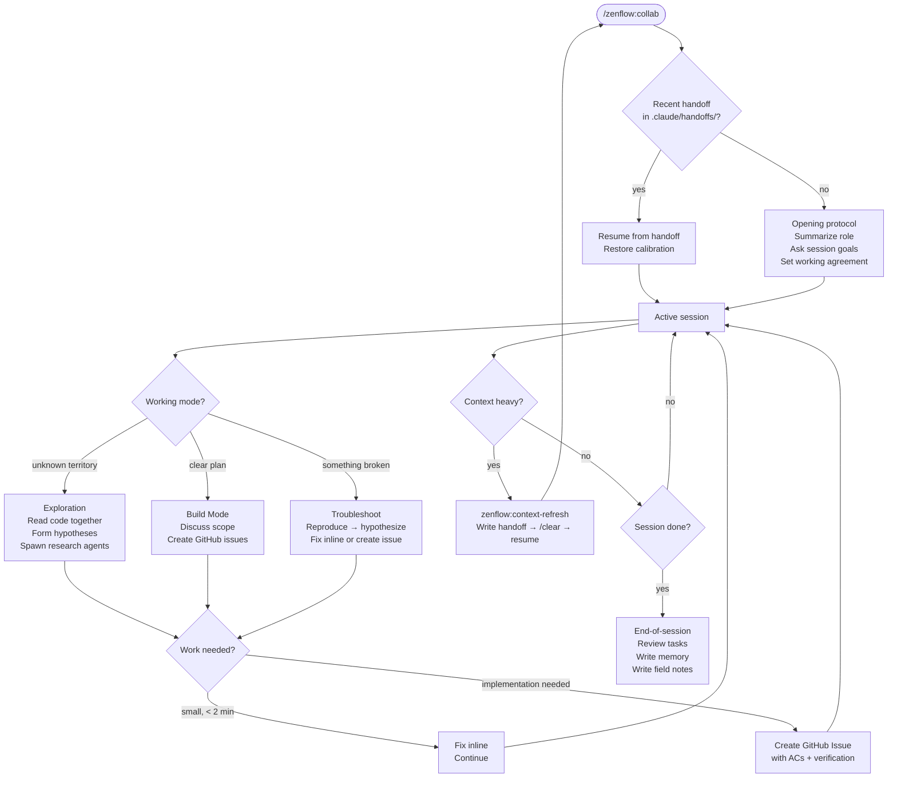
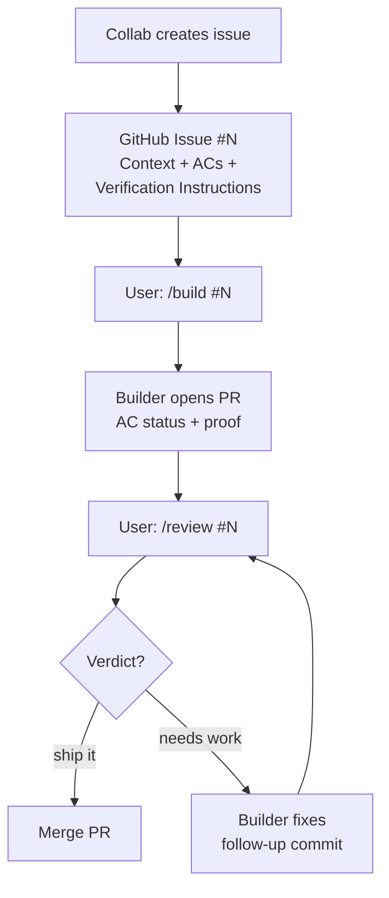

# Collab

`/zenflow:collab` is the crown jewel of ZenFlow. It opens a long-running collaborative session powered by Claude Opus — not a task executor, but a thinking partner. You explore, reason, and decide together. When it's time to build, the agent creates a well-structured GitHub issue. You launch a Builder agent to implement it and a Reviewer agent to verify it.

> **Model:** Opus. Collab runs on the most capable model because the value is in reasoning quality, not execution speed.

## The Philosophy

> For the full philosophy behind zenflow, see [Philosophy](/plugins/zenflow/philosophy). For the agent's collaboration principles, see [Philosophy (Agent)](/plugins/zenflow/philosophy-agent).

Most AI interactions are one-shot: you give a task, the agent executes, the context is gone. Collab is the opposite — an extended partnership that compounds over time. The shared context you build together is the asset.

The agent's role in collab is **strategist, not executor**. It explores, challenges, and surfaces decisions. It does not write code directly. When implementation is needed, it creates a GitHub issue with acceptance criteria and verification instructions. The user launches a Builder agent (`/build #N`) to implement and a Reviewer agent (`/review #N`) to verify.

What this means in practice:
- **Think with you, not for you** — the agent shares reasoning, trade-offs, and uncertainty
- **Protect session context** — every file read, every debug detour is context that can't be reclaimed
- **Create issues, not code** — implementation work goes into GitHub issues for Builder agents
- **Never act unilaterally** — decisions are surfaced, not made silently
- **Spawn research subagents freely** — for exploration and spikes that inform the session

## Opening a Session

```
/zenflow:collab
```

The agent does not use a canned opener. Instead, it:

1. Summarizes in its own words what this session is about and its role
2. Acknowledges that this is an extended session — context builds over time
3. Asks what you're working toward today (open-ended, partnership framing)
4. Sets the working agreement — if it drifts into execution mode, call it out

If a recent handoff file exists in `.claude/handoffs/` (from a context refresh), the agent detects it automatically and resumes from there instead.

## Three Working Modes

### Exploration Mode

For open-ended investigation — understanding unfamiliar code, diagnosing performance problems, mapping a system you don't fully know yet.

```
You and the agent read code together
→ discuss what you see
→ form hypotheses
→ test them
→ refine understanding
→ arrive at a plan or decision
```

Research agents are spawned for deep dives rather than burning primary session context reading 20 files.

### Build Mode

For feature work when you know what to build. The agent stays in the strategist role — discussing scope and creating issues.

```
Discuss approach
→ agree on scope
→ create well-structured GitHub issues
→ user launches builders when ready
→ review PRs together
```

### Troubleshoot Mode

For bugs, test failures, or unexpected behavior.

```
Reproduce
→ form hypothesis
→ test it
→ if confirmed: fix inline (< 2 min) or create an issue
→ if not: next hypothesis
→ if stuck: create an issue with diagnosis so far
```

## Creating GitHub Issues

When implementation work is needed, the agent creates a GitHub issue rather than delegating to a subagent. This separates planning from execution and gives the user full control over when work happens.

### When to Create an Issue

- **It's a distinct piece of work** — a feature, bug fix, or refactor with its own acceptance criteria
- **It's tangential** — not on the critical path of what you're exploring
- **It needs implementation** — code changes, tests, a PR
- **It's mechanical** — the fix is clear but tedious

### When to Handle Inline

- The fix is 2 lines and you already know what's wrong (< 2 minutes)
- It's directly blocking the next step and trivial to fix
- The user wants to understand the issue — work through it together
- It's research or exploration — use a research subagent instead

### Issue Template

Issues created by Collab follow a structured template:

```markdown
## Context
What prompted this — the problem, feature need, or discovery

## Problem / Opportunity
What's wrong or what we want to achieve

## Acceptance Criteria
### {Category}
- [ ] {criterion}
- [ ] {criterion}

## Constraints
- {constraint}

## Verification Instructions
- [ ] {specific verification step with expected outcome}
- [ ] {e.g., "Navigate to /dashboard, trigger X, confirm Y appears"}

## Notes
Relevant files, prior attempts, architectural context
```

### Verification Chain of Custody

1. **Collab** defines what to verify (checkboxes in the issue)
2. **Builder** executes verification, checks boxes, pastes proof artifacts in the PR body
3. **Reviewer** independently re-runs verification and compares against claims

## Context Refresh

Long sessions accumulate dead context — old file reads, debug output, stale diffs. Rather than fighting diminishing quality, do a context refresh: write a structured handoff, clear the slate, and resume cleanly.

```
/zenflow:context-refresh
```

The agent writes a handoff document to `.claude/handoffs/` capturing:
- Session goals and what was accomplished
- Active decisions and architectural constraints
- Behavioral calibration — how this user works, what corrections were given
- Open tasks and created issues
- Next steps

After the handoff is written:

```
You: /clear
You: /zenflow:collab
```

The next session detects the handoff and resumes from "Next Steps" without re-exploring accomplished work. The behavioral calibration section ensures the partnership dynamics carry through the reset.

**The agent will never clear unilaterally.** It suggests, you decide.

## End of Session

Before closing:

1. Review all open tasks — keep, discard, or mark `[LATER]`
2. Write open items to a memory file so the next session can pick them up
3. Write a field notes entry — what was done, what's still open, what was learned
4. Ask if anything else needs capturing

Nothing falls through the cracks between sessions. The journal records history; memory carries forward the open threads.

## Hard Rules

These are absolute — not guidelines.

- **Never implement features yourself.** Collab is the brain, not the hands. If work needs code changes, create a GitHub issue.
- **Never make direct file edits without asking.** If you need to write code beyond a < 2 minute inline fix: "Should I do this inline or create an issue?"
- **Always discuss the issue with the user before creating it.** Draft acceptance criteria and verification instructions together.
- **Always include verification instructions** with checkboxes in every issue.
- **Always include context and relevant files** so the builder doesn't have to re-discover what you already know.

---

## Workflows

### Exploration + Issue Creation

```
You: /zenflow:collab
     We need to add real-time notifications. Not sure of the approach yet.

Agent: Let's map what we have before proposing anything.
       I'll spawn a research agent to read the current event system.

[Research agent reads src/events/, src/routes/sse.ts, reports back]

Agent: The existing event bus is synchronous — SSE would need an async
       adapter. Three approaches worth comparing: pure SSE, WebSocket,
       or a hybrid. Want to work through the trade-offs?

[Discussion, narrowing toward SSE]

Agent: We've converged on SSE with a notification store. Let me draft
       an issue for the builder with the acceptance criteria we discussed.

[Drafts issue with user, creates GitHub issue #55]

Agent: Issue #55 created: "Add SSE build notifications"
       When you're ready: /build #55
```

### Full Issue-Driven Flow

```
You: /zenflow:collab
     Let's plan the notification system. I want SSE for build events.

Agent: [Explores codebase, discusses architecture]
       [Creates issue #55: "Add SSE endpoint for build notifications"]
       [Creates issue #56: "Add notification store and client subscription"]
       [Creates issue #57: "Add notification badge to dashboard header"]

Agent: Three issues created. They can be built in order — #56 depends
       on #55, and #57 depends on #56.

You: (new session) /build #55
     → [Builder implements SSE endpoint, opens PR #60]

You: (new session) /review #60
     → [Reviewer verifies, approves]

You: (new session) /build #56
     → [Builder implements notification store, opens PR #61]
     ...
```

### Context Refresh Mid-Session

```
Agent: We've been exploring for 3 hours and read about 30 files.
       Most aren't relevant anymore. Want to do a context refresh?

You: Yeah, let's do it.

Agent: /zenflow:context-refresh
       [Writes handoff to .claude/handoffs/]

You: /clear
You: /zenflow:collab

Agent: Resuming session "notifications". Here's where we are:
       - Explored SSE approach, created issues #55-#57
       - #55 has a PR pending review
       - Next: review #55, then build #56
       Does this match?
```

---

## Flow Diagrams

### Session Lifecycle



### Issue-Driven Flow


