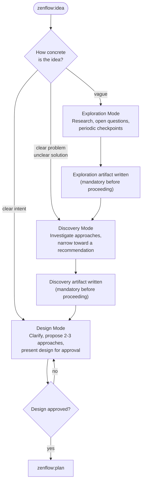
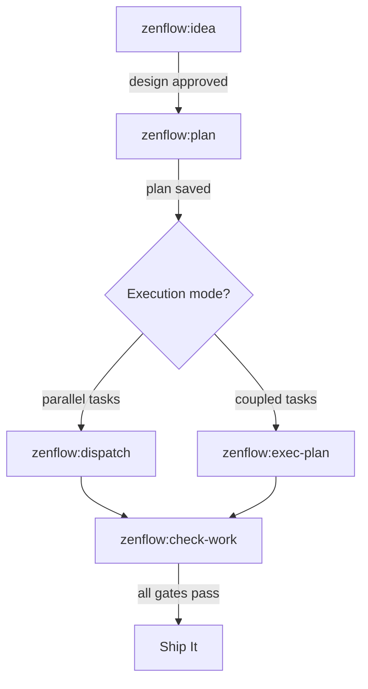
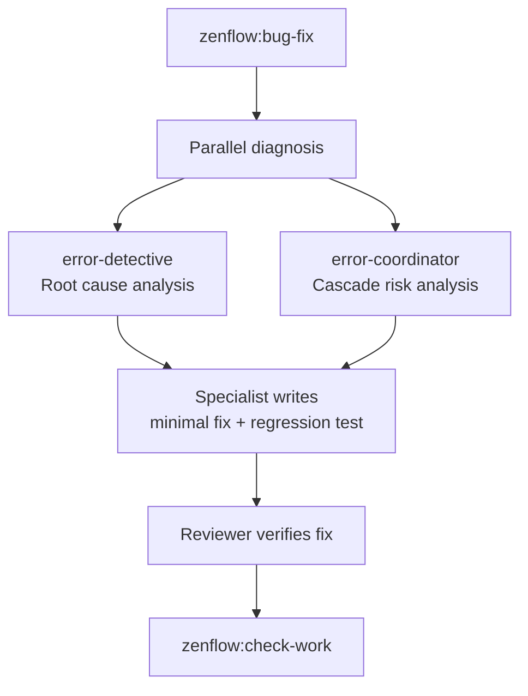
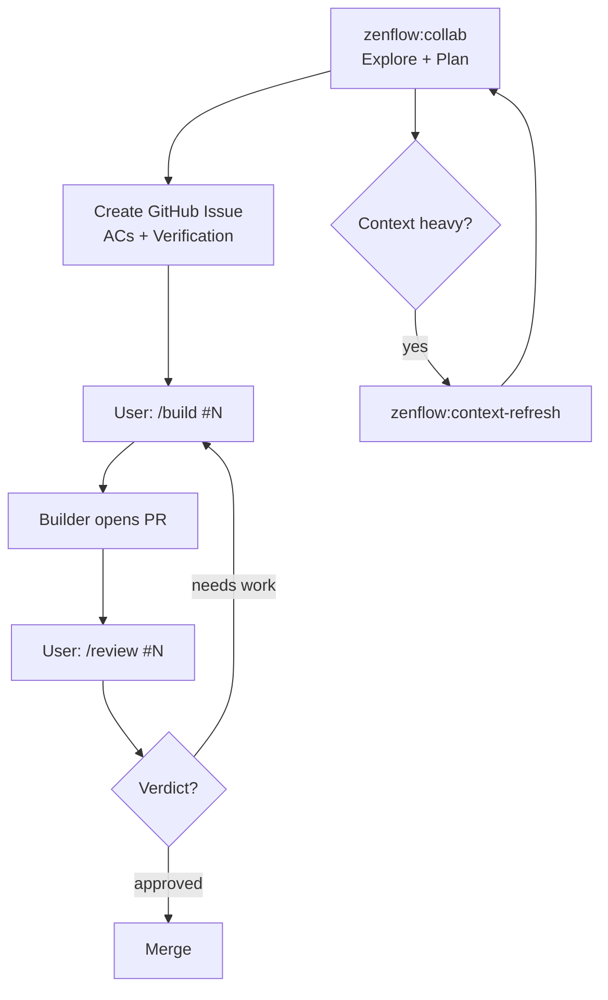

# Workflows & Diagrams

Common usage patterns with diagrams and step-by-step examples.

## Standard Feature Development

The most common flow: new feature from scratch through to a reviewed, validated implementation.

```
/zenflow:idea    Describe the feature you want to build
/zenflow:plan    Write the implementation plan
/zenflow:dispatch    Execute the plan with parallel subagents
/zenflow:check-work  Run lint, format, tests, docs, journal
```

**Example session:**

```
You: /zenflow:idea  Add webhook support for order status changes

[Agent explores requirements, proposes design, you approve]

You: /zenflow:plan

[Agent writes resources/plans/012-webhooks.md]

You: /zenflow:dispatch

[Agent spawns subagents per task; each goes through spec + quality review]

You: /zenflow:check-work

[All 5 gates pass]
```

---

## Collaborative Session

`collab` is ZenFlow's crown jewel — a long-running working session where you and Claude Opus operate as partners. Not a task executor: a thinking partner that explores, reasons, and creates GitHub issues for implementation work. See the **[Collab](/plugins/zenflow/collab)** page for the full reference.

```
/zenflow:collab    Start a collaborative session
/zenflow:build     Build a GitHub issue into a PR
/zenflow:review    Review a PR with structured verification
```

When implementation work is needed, Collab creates a GitHub issue. The user launches a Builder:

```
You: /zenflow:collab

Agent: Found a rate limiter bug while exploring. Let me draft an issue.
       [Creates issue #55 with ACs and verification instructions]

Agent: Issue #55 created. When ready: /build #55

You: (new session) /build #55
     → [Builder implements, opens PR #60]

You: (new session) /review #60
     → [Reviewer verifies, approves]
```

If the session runs long and context gets noisy:

```
You: /zenflow:context-refresh

[Agent writes .claude/handoffs/notifications-2026-04-04T14:30.md]
[Captures goals, decisions, behavioral calibration, open tasks, next steps]

You: /clear
You: /zenflow:collab

[Agent detects handoff, restores calibration, resumes from Next Steps]
```

---

## Bug Fix

```
/zenflow:bug-fix    Describe the bug or paste the error

[Two agents diagnose in parallel: root cause + cascade risk]
[A specialist writes the minimal fix with a regression test]
[A reviewer verifies the fix]

/zenflow:check-work
```

---

> **Note:** `/zenflow:audit`, `/zenflow:refactor`, `/zenflow:review`, and `/zenflow:status` workflows were removed on 2026-04-15 pending redesign. See issues [#8](https://github.com/brewpirate/zen-flow/issues/8)–[#11](https://github.com/brewpirate/zen-flow/issues/11).

---

## Flow Diagrams

### Idea Modes



### Full Pipeline



### Bug Fix Pipeline



### 3-Agent Issue-Driven Flow


