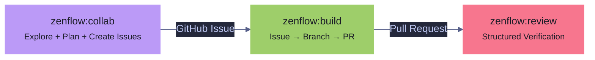

# ZenFlow

A structured development pipeline for Claude Code that turns ideas into shipped, validated code through a series of composable skills.

ZenFlow is derived from [Superpowers](https://github.com/obra/superpowers) by Jesse Vincent — a pioneering set of Claude Code skills for structured, agent-driven development. Zen Flow adapts and extends those ideas into a bundled plugin with additional skills, hooks, agents, and configuration.

> **Experimental** — This plugin is under active development and its APIs, commands, and behavior may change without notice. Use at your own risk.

## Philosophy

> **Deep dive:** [Philosophy (Human)](PHILOSOPHY-HUMAN.md) | [Philosophy (Agent)](PHILOSOPHY-AGENT.md)

Every feature follows the same path: **idea → plan → build → review**. Three independent agents communicate through GitHub primitives — Collab creates issues, Builder ships PRs, Reviewer verifies. The user orchestrates by launching each agent explicitly. Every decision surfaces via `AskUserQuestion` — no surprises.

Zen Flow is opinionated about process but flexible about execution. You can run the full pipeline or invoke individual skills as needed.

## Installation

```bash
/plugin marketplace add brewpirate/zenflow
/plugin install zenflow@zen
/plugin install field-notes@zen
/reload-plugins
```

## Quick Start

Run `/zen` to see the interactive menu, or invoke any skill directly:

```
/zenflow:idea    Build a new user notification system
/zenflow:plan
/zenflow:dispatch
```

## The Pipeline



### Full Pipeline

1. **`/zenflow:idea`** — Three modes based on idea maturity:
   - **Exploration** ("an idea") — open questions, research agents, periodic checkpoints. No proposals until the user signals readiness. Produces a mandatory exploration artifact.
   - **Discovery** ("a problem") — clear pain, unclear solution. Skips problem exploration, investigates solution approaches. Produces a mandatory discovery artifact.
   - **Design** ("the idea") — clear intent. Clarify → propose 2-3 approaches → present design → get approval.

   No code until the design is approved.

2. **`/zenflow:plan`** — Write a detailed implementation plan with bite-sized tasks, complete code in every step, exact commands, and TDD. Saved to `resources/plans/NNN-name.md`.

3. **Execute** (pick one):
   - **`/zenflow:dispatch`** — Parallel subagents per task with two-stage review (spec compliance + code quality). Recommended for plans with independent tasks.
   - **`/zenflow:exec-plan`** — Sequential execution with checkpoints. Better for tightly coupled tasks or when you want more control.

4. **`/zenflow:check-work`** — Five quality gates in order: lint, format, tests, docs, journal. Auto-discovers project commands from `package.json`/`CLAUDE.md`. Auto-fixes what it can, launches subagents for the rest. Enforced by a Stop hook — you cannot finish an execution session without running this.

### Standalone Skills

These work independently of the pipeline:

- **`/zenflow:build`** — Build a GitHub issue into a PR. User-launched with an issue number (`/build #42`). Reads the issue, confirms with user, creates a linked branch, implements against acceptance criteria, runs verification, and opens a PR. Every decision surfaces via `AskUserQuestion`.

- **`/zenflow:review`** — Review a PR with structured feedback and independent runtime verification. User-launched with a PR number (`/review #42`). Reads the diff, runs a 5-area checklist, independently verifies claims via Playwright, posts a structured review comment with severity tiers. Routes bugs through `zenflow:bug-fix`.

- **`/zenflow:collab`** — Collaborative working session (Opus model). You and the agent work together as a team — exploring code, researching approaches, and planning. When implementation work is needed, Collab creates well-structured GitHub issues with acceptance criteria and verification instructions. The user launches Builder and Reviewer agents separately. Supports mid-session **context refresh** via `/zenflow:context-refresh`.

- **`/zenflow:context-refresh`** — Shed accumulated context mid-session without losing continuity. Writes a structured knowledge handoff document to `.claude/handoffs/` capturing session goals, decisions, behavioral calibration, observations, open tasks, and next steps. After the user runs `/clear` and re-invokes `/zenflow:collab`, the session resumes from the handoff with minimal context loss. Designed for long collab sessions where dead context (old file reads, debug output) degrades quality.

- **`/zenflow:bug-fix`** — Four-agent diagnostic pipeline: two agents diagnose in parallel (root cause + cascade risk), a specialist writes the minimal fix with a regression test, a reviewer verifies.

- **`/zenflow:docs`** — Create or update project documentation. Reads `.claude/zen.local.md` for doc paths, assesses what's stale, asks what to update, writes it.

> **Temporarily removed (tracked for restoration):** `/zenflow:audit`, `/zenflow:refactor`, `/zenflow:review`, `/zenflow:status`, and `testing-anti-patterns` were pruned on 2026-04-15 — see issues [#8](https://github.com/brewpirate/zen-flow/issues/8), [#9](https://github.com/brewpirate/zen-flow/issues/9), [#10](https://github.com/brewpirate/zen-flow/issues/10), [#11](https://github.com/brewpirate/zen-flow/issues/11), [#12](https://github.com/brewpirate/zen-flow/issues/12).

### Field Notes (separate plugin)

- **`/field-notes:write`** — Append a structured entry after completing work. Captures what happened, what went wrong, and what was learned.
- **`/field-notes:read`** — View recent entries with filtering by type, outcome, origin, branch, or keyword.
- **`/field-notes:summary`** — Aggregate patterns across sessions — recurring blockers, hot files, health signals.
- **`/field-notes:reflect`** — End-of-session retrospective with actionable takeaways.

Journal entries are stored in `.claude/journal.jsonl` (single file, append-only). See the [field-notes README](../field-notes/README.md) for the full schema and HTML viewer.

## Skills Reference

| Skill | Invocation | Model | Purpose |
|-------|-----------|-------|---------|
| Menu | `/zen` | — | Interactive skill picker |
| Init | `/zenflow:init` | — | Scan codebase and agents to generate zen.local.md config |
| Collab | `/zenflow:collab` | Opus | Collaborative session — explore, research, create issues |
| Build | `/zenflow:build` | Opus | Build a GitHub issue into a PR |
| Review | `/zenflow:review` | Opus | Review a PR with structured verification |
| Context Refresh | `/zenflow:context-refresh` | Opus | Shed context mid-session with knowledge handoff |
| Idea | `/zenflow:idea` | — | Explore → discover → design (three modes) |
| Plan | `/zenflow:plan` | — | Write implementation plan from spec |
| Execute (parallel) | `/zenflow:dispatch` | — | Subagent-per-task with two-stage review |
| Execute (sequential) | `/zenflow:exec-plan` | — | Step-by-step with checkpoints |
| Validate | `/zenflow:check-work` | — | Lint, format, tests, docs, journal gates |
| Bug Fix | `/zenflow:bug-fix` | — | Diagnose and fix with agent pipeline |
| Docs | `/zenflow:docs` | — | Create or update documentation |
| Playwright Verification | — | — | Runtime verification with proof artifacts (companion skill) |
| Journal Write | `/field-notes:write` | — | Append structured journal entry |
| Journal Read | `/field-notes:read` | — | View and filter entries |
| Journal Summary | `/field-notes:summary` | — | Aggregate patterns and health signals |
| Journal Reflect | `/field-notes:reflect` | — | End-of-session retrospective |

## Agents

| Agent | Model | Purpose | Source |
|-------|-------|---------|--------|
| `error-coordinator` | Sonnet | Cascade risk analysis in zenflow:bug-fix | [awesome-claude-code-subagents](https://github.com/VoltAgent/awesome-claude-code-subagents/blob/main/categories/09-meta-orchestration/error-coordinator.md) |
| `error-detective` | Sonnet | Root cause analysis in zenflow:bug-fix | [awesome-claude-code-subagents](https://github.com/VoltAgent/awesome-claude-code-subagents/blob/main/categories/04-quality-security/error-detective.md) |

> Agent assignments for skills are configured in `.claude/zen.local.md`. Run `/zenflow:init` to auto-generate config from your installed agents.

## Hooks

Zen Flow includes three hooks that enforce workflow discipline:

| Hook | Type | What it does |
|------|------|-------------|
| `enforce-plan-mode-tools` | Stop | In plan mode, blocks ending a turn without calling `ExitPlanMode` or `AskUserQuestion` |
| `enforce-work-validation` | Stop | After `zenflow:exec-plan` or `zenflow:dispatch`, blocks finishing without running `zenflow:check-work` |
| `enforce-local-plans` | PreToolUse | Redirects plan file writes from `~/.claude/plans/` to the project's `resources/plans/` directory |

These fire automatically when the plugin is installed. No configuration needed.

## Configuration

All zen configuration lives in `.claude/zen.local.md` — a single file with YAML frontmatter for structured config and a markdown body for freeform notes. Run `/zenflow:init` to generate this file automatically from your codebase and installed agents.

### Config structure

```yaml
---
project:
  language: typescript       # detected primary language
  framework: nextjs          # detected framework (if any)

docs:
  readme: README.md
  architecture: docs/ARCHITECTURE.md
  claude: CLAUDE.md
  changelog: CHANGELOG.md
  paths:
    - name: Guides
      dir: docs/
      glob: "*.md"
    - name: API Reference
      path: docs/api-reference.md

agents:
  - domain: api-routes
    dir: packages/server/src/server/routes/
    glob: "*.ts"
    agent: Backend Architect
    rules:
      - error-handling
      - options-objects
      - async-patterns
  - domain: frontend
    dir: packages/frontend/src/components/
    glob: "**/*.tsx"
    agent: Frontend Developer
    rules:
      - react-patterns
      - composition-patterns
---

Style notes: use tables for config options, code blocks for commands.
```

### Config keys

| Key | Used by | Description |
|-----|---------|-------------|
| `project` | All skills | Detected language and framework |
| `docs` | zenflow:docs | Documentation file paths and directories |
| `agents` | zenflow:bug-fix | Domain-to-agent mapping for the codebase |

### agents fields

| Field | Required | Description |
|-------|----------|-------------|
| `domain` | yes | Logical name for this codebase section |
| `dir` | yes | Directory path relative to project root |
| `glob` | no | File pattern (default: `**/*`) |
| `agent` | no | Agent name — must match an installed agent's `name` frontmatter |
| `rules` | no | Rule names resolved to `.claude/rules/{name}.md` |

### Layering

- **Project-level:** `.claude/zen.local.md` — committed or gitignored per team preference
- **User-level:** `~/.claude/zen.local.md` — personal defaults across all projects
- Project config overrides user config.

## Design Principles

- **Human controls commits** — agents write code and present changes; the human decides when to commit
- **Project-agnostic** — no hardcoded toolchain; skills discover commands from `package.json`, `CLAUDE.md`, or config files
- **Mandatory artifacts** — exploration and discovery modes produce written summaries before transitioning; if the session dies, the artifact survives
- **Issue-driven workflow** — collab creates GitHub issues instead of delegating to subagents; Builder and Reviewer are independent agents launched by the user
- **Hooks enforce gates** — you can't skip validation, so quality is structural, not aspirational

## Plugin Structure

```
zen-marketplace/
├── .claude-plugin/
│   └── marketplace.json
├── plugins/zenflow/
│   ├── .claude-plugin/
│   │   └── plugin.json
│   ├── agents/
│   │   ├── error-detective.md        # Sonnet — root cause analysis
│   │   └── error-coordinator.md      # Sonnet — cascade risk analysis
│   ├── commands/
│   │   ├── zenflow.md                # /zen interactive menu
│   │   ├── build.md                  # /zenflow:build
│   │   ├── review.md                 # /zenflow:review
│   │   ├── idea.md                   # /zenflow:idea
│   │   ├── plan.md                   # /zenflow:plan
│   │   ├── dispatch.md               # /zenflow:dispatch
│   │   ├── exec-plan.md              # /zenflow:exec-plan
│   │   ├── check-work.md             # /zenflow:check-work
│   │   ├── bug-fix.md                # /zenflow:bug-fix
│   │   └── docs.md                   # /zenflow:docs
│   ├── hooks/
│   │   └── scripts/
│   │       ├── enforce-plan-mode-tools.sh    # Stop — plan mode discipline
│   │       ├── enforce-work-validation.sh    # Stop — check-work enforcement
│   │       └── enforce-local-plans.sh        # PreToolUse — keep plans in project
│   └── skills/
│       ├── idea/SKILL.md             # zenflow:idea — explore → discover → design
│       ├── plan/SKILL.md             # zenflow:plan — write implementation plans
│       ├── exec-plan/SKILL.md        # zenflow:exec-plan — sequential execution
│       ├── dispatch/                  # zenflow:dispatch — parallel subagent execution
│       │   ├── SKILL.md
│       │   ├── implementer-prompt.md
│       │   ├── spec-reviewer-prompt.md
│       │   └── code-quality-reviewer-prompt.md
│       ├── check-work/SKILL.md       # zenflow:check-work — 5 quality gates
│       ├── bug-fix/SKILL.md          # zenflow:bug-fix — diagnostic pipeline
│       ├── docs/SKILL.md             # zenflow:docs — documentation
│       ├── build/SKILL.md             # zenflow:build — issue → branch → PR
│       ├── review/SKILL.md           # zenflow:review — structured PR review
│       ├── playwright-verification/SKILL.md  # runtime verification companion
│       ├── collab/SKILL.md           # zenflow:collab — collaborative session (Opus)
│       ├── context-refresh/SKILL.md  # zenflow:context-refresh — mid-session context shed
│       └── init/SKILL.md             # zenflow:init — generate zen.local.md config
└── plugins/field-notes/
    ├── .claude-plugin/
    │   └── plugin.json
    ├── commands/
    │   ├── write.md                  # /field-notes:write
    │   ├── read.md                   # /field-notes:read
    │   ├── summary.md                # /field-notes:summary
    │   └── reflect.md                # /field-notes:reflect
    ├── scripts/
    │   └── journal.html              # Browser-based viewer (Tokyo Night)
    └── skills/
        ├── write/SKILL.md            # field-notes:write
        ├── read/SKILL.md             # field-notes:read
        ├── summary/SKILL.md          # field-notes:summary
        ├── reflect/SKILL.md          # field-notes:reflect
        └── view/SKILL.md             # field-notes:view — open in browser
```

## Workflows & Diagrams

See **[workflows.md](workflows.md)** for all workflow diagrams and usage examples.

**Diagrams:** [3-Agent Flow](workflows.md#3-agent-issue-driven-flow) | [Idea Modes](workflows.md#zenflowidea--three-modes) | [Full Pipeline](workflows.md#full-pipeline-flow) | [Bug Fix](workflows.md#bug-fix-pipeline) | [Context Refresh](workflows.md#context-refresh-flow)

**Examples:** [Issue-Driven Feature](workflows.md#issue-driven-feature) | [Builder Session](workflows.md#builder-session) | [Reviewer Session](workflows.md#reviewer-session) | [Context Refresh](workflows.md#context-refresh-mid-session) | [Bug Fix](workflows.md#bug-fix)