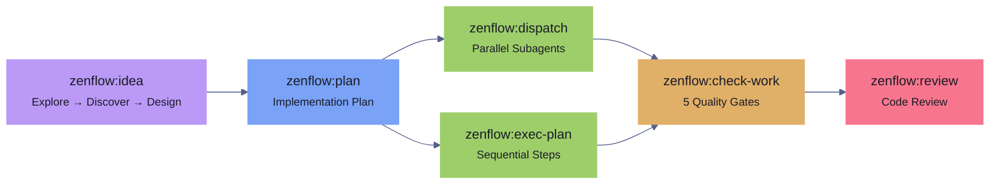
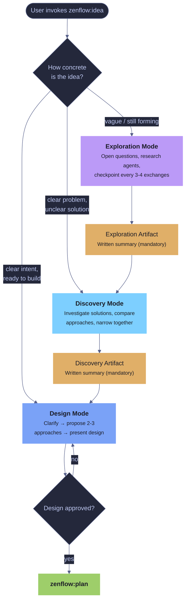
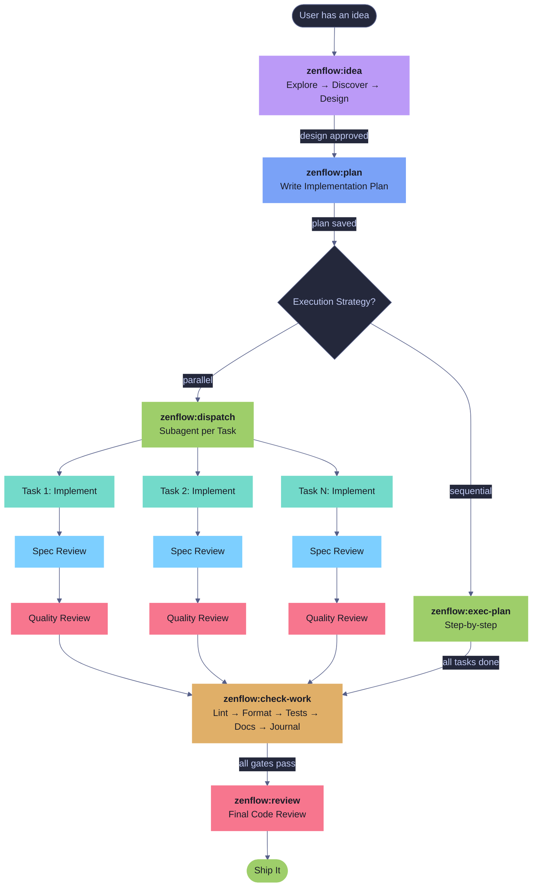
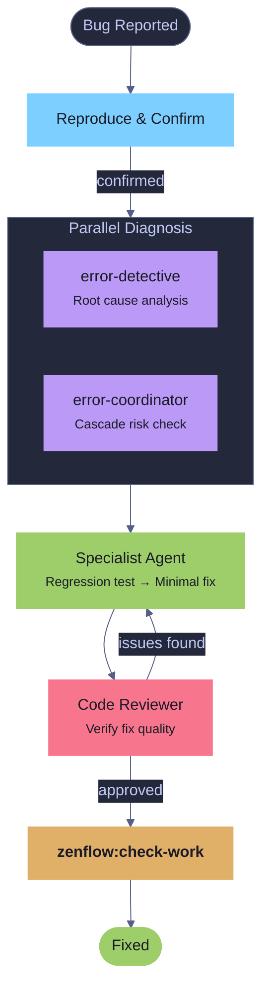
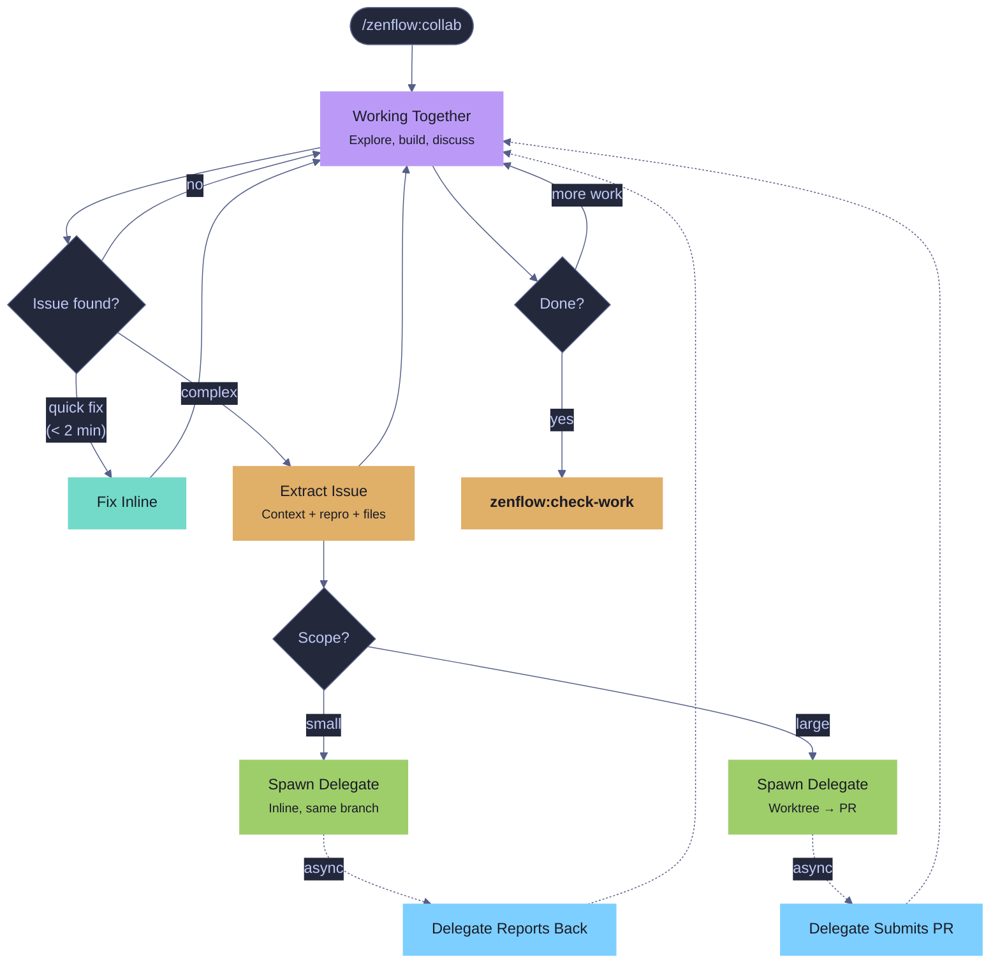
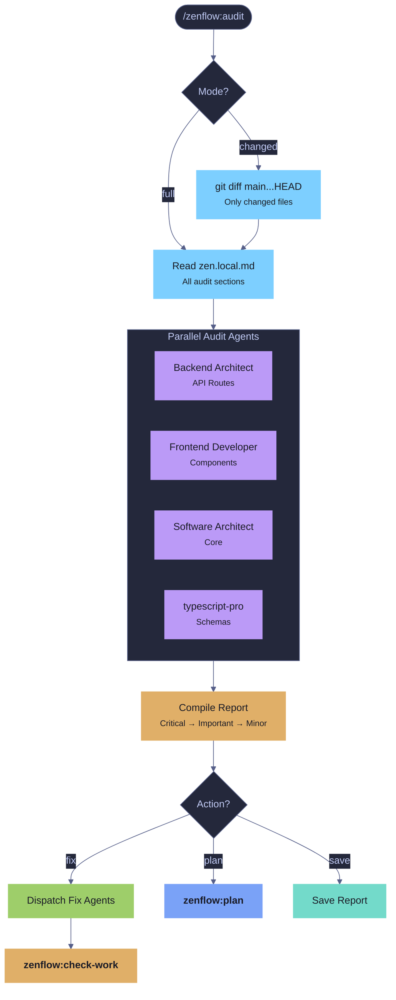

# ZenFlow

A structured development pipeline for Claude Code that turns ideas into shipped, validated code through a series of composable skills.

ZenFlow is derived from [Superpowers](https://github.com/obra/superpowers) by Jesse Vincent — a pioneering set of Claude Code skills for structured, agent-driven development. Zen Flow adapts and extends those ideas into a bundled plugin with additional skills, hooks, agents, and configuration.

## Philosophy

Every feature follows the same path: **idea → plan → execute → validate → review**. Each step has a dedicated skill with clear inputs, outputs, and quality gates. Skip a step and a hook blocks you. Follow the flow and you get consistent, high-quality results regardless of task complexity.

Zen Flow is opinionated about process but flexible about execution. You can run the full pipeline or invoke individual skills as needed.

## Installation

```bash
/plugin marketplace add brewpirate/zenflow
/plugin install zenflow@zen
/plugin install agent-journal@zen
/reload-plugins
```

## Quick Start

Run `/zen` to see the interactive menu, or invoke any skill directly:

```
/zenflow:idea    Build a new user notification system
/zenflow:plan
/zenflow:dispatch
```

## The Marketplace

Two plugins, one marketplace:

| Plugin | Skills | Purpose |
|--------|--------|---------|
| **zen** | 12 skills, 1 agent, 1 command, 2 hooks | The development workflow |
| **agent-journal** | 4 skills, HTML viewer | Structured work logging |

## The Pipeline



### Full Pipeline

1. **`/zenflow:idea`** — Three modes based on idea maturity:
   - **Exploration** ("an idea") — open questions, research agents, periodic checkpoints. No proposals until the user signals readiness. Produces a mandatory exploration artifact.
   - **Discovery** ("a problem") — clear pain, unclear solution. Skips problem exploration, investigates solution approaches. Produces a mandatory discovery artifact.
   - **Design** ("the idea") — clear intent. Clarify → propose 2-3 approaches → present design → get approval.

   No code until the design is approved.

2. **`/zenflow:plan`** — Write a detailed implementation plan with bite-sized tasks, complete code in every step, exact commands, and TDD. Saved to `resources/plans/NNN-name.md`.

3. **Execute** (pick one):
   - **`/zenflow:dispatch`** — Parallel subagents per task with two-stage review (spec compliance + code quality). Recommended for plans with independent tasks.
   - **`/zenflow:exec-plan`** — Sequential execution with checkpoints. Better for tightly coupled tasks or when you want more control.

4. **`/zenflow:check-work`** — Five quality gates in order: lint, format, tests, docs, journal. Auto-discovers project commands from `package.json`/`CLAUDE.md`. Auto-fixes what it can, launches subagents for the rest. Enforced by a Stop hook — you cannot finish an execution session without running this.

5. **`/zenflow:review`** — Dispatch a code reviewer subagent with the git diff. Categorizes issues as Critical/Important/Minor with file:line references and a clear merge verdict.

### Standalone Skills

These work independently of the pipeline:

- **`/zenflow:collab`** — Collaborative working session (Opus model). You and the agent work together as a team — exploring code, building features, troubleshooting problems. When issues arise, they're extracted and delegated to fresh `collab-delegate` agents — either inline (quick fixes) or in **isolated worktrees** (larger issues that get their own branch and PR). Delegates load all project rules dynamically before starting work.

- **`/zenflow:bug-fix`** — Four-agent diagnostic pipeline: two agents diagnose in parallel (root cause + cascade risk), a specialist writes the minimal fix with a regression test, a reviewer verifies.

- **`/zenflow:docs`** — Create or update project documentation. Reads `.claude/zen.local.md` for doc paths, assesses what's stale, asks what to update, writes it.

- **`/zenflow:audit`** — Audit codebase sections against configurable code standards. Dispatches specialist agents in parallel per section, each checking against rules defined in `.claude/rules/`. Supports **changed mode** (`/zenflow:audit changed`) for diff-only audits — only files modified vs main get checked. Full mode for comprehensive sweeps.

- **`/zenflow:refactor`** — Structured refactoring pipeline. Analyzes target code, proposes changes with before/after examples, ensures regression test coverage exists, then executes. Internal API changes are allowed if all callers are updated in the same scope; external-facing changes are not refactors.

- **`/zenflow:status`** — Quick snapshot of project state: active plans (any frontmatter `status != complete`), task progress, git status, session history, and journal entries. Supports **recent mode** (`/zenflow:status recent`) which verifies tasks from the last 72h were actually completed by inspecting tests, commits, and files, then stamps plans with `validated` frontmatter.

### Agent Journal (separate plugin)

- **`/agent-journal:write`** — Append a structured entry after completing work. Captures what happened, what went wrong, and what was learned.
- **`/agent-journal:read`** — View recent entries with filtering by type, outcome, origin, branch, or keyword.
- **`/agent-journal:summary`** — Aggregate patterns across sessions — recurring blockers, hot files, health signals.
- **`/agent-journal:reflect`** — End-of-session retrospective with actionable takeaways.

Journal entries are stored in `.claude/journal.jsonl` (single file, append-only). See the [agent-journal README](plugins/agent-journal/README.md) for the full schema and HTML viewer.

## Skills Reference

| Skill | Invocation | Model | Purpose |
|-------|-----------|-------|---------|
| Menu | `/zen` | — | Interactive skill picker |
| Init | `/zenflow:init` | — | Scan codebase and agents to generate zen.local.md config |
| Collab | `/zenflow:collab` | Opus | Collaborative session with inline + worktree delegation |
| Idea | `/zenflow:idea` | — | Explore → discover → design (three modes) |
| Plan | `/zenflow:plan` | — | Write implementation plan from spec |
| Execute (parallel) | `/zenflow:dispatch` | — | Subagent-per-task with two-stage review |
| Execute (sequential) | `/zenflow:exec-plan` | — | Step-by-step with checkpoints |
| Validate | `/zenflow:check-work` | — | Lint, format, tests, docs, journal gates |
| Review | `/zenflow:review` | — | Code review via subagent |
| Bug Fix | `/zenflow:bug-fix` | — | Diagnose and fix with agent pipeline |
| Docs | `/zenflow:docs` | — | Create or update documentation |
| Audit | `/zenflow:audit [changed]` | — | Audit code sections against standards; changed = diff-only |
| Refactor | `/zenflow:refactor` | — | Structured refactoring with regression safety |
| Status | `/zenflow:status [recent]` | — | Project state snapshot; recent mode verifies recent work |
| Journal Write | `/agent-journal:write` | — | Append structured journal entry |
| Journal Read | `/agent-journal:read` | — | View and filter entries |
| Journal Summary | `/agent-journal:summary` | — | Aggregate patterns and health signals |
| Journal Reflect | `/agent-journal:reflect` | — | End-of-session retrospective |

## Agents

| Agent | Model | Purpose | Source |
|-------|-------|---------|--------|
| `collab-delegate` | Opus | Fresh specialist spawned by zenflow:collab to handle extracted issues | — |
| `error-coordinator` | — | Cascade risk analysis in zenflow:bug-fix | [awesome-claude-code-subagents](https://github.com/VoltAgent/awesome-claude-code-subagents/blob/main/categories/09-meta-orchestration/error-coordinator.md) |
| `error-detective` | — | Root cause analysis in zenflow:bug-fix | [awesome-claude-code-subagents](https://github.com/VoltAgent/awesome-claude-code-subagents/blob/main/categories/04-quality-security/error-detective.md) |

> Agent assignments for skills are configured in `.claude/zen.local.md`. Run `/zenflow:init` to auto-generate config from your installed agents.

The collab-delegate agent:
- **Loads all project rules dynamically** — globs `.claude/rules/*.md` and reads every file, announcing each one
- **Has zen skills** — can invoke `zenflow:plan`, `zenflow:check-work`, `zenflow:review`, and `testing-anti-patterns`
- **Receives structured handoffs** — context, reproduction steps, relevant files, what was already tried
- **Can work in worktrees** — isolated branch, commits freely, submits PR as review gate
- **Can escalate** — reports `BLOCKED` if context is insufficient rather than guessing

## Hooks

Zen Flow includes two Stop hooks that enforce workflow discipline:

| Hook | What it does |
|------|-------------|
| `enforce-plan-mode-tools` | In plan mode, blocks ending a turn without calling `ExitPlanMode` or `AskUserQuestion` |
| `enforce-work-validation` | After `zenflow:exec-plan` or `zenflow:dispatch`, blocks finishing without running `zenflow:check-work` |

These fire automatically when the plugin is installed. No configuration needed.

## Configuration

All zen configuration lives in `.claude/zen.local.md` — a single file with YAML frontmatter for structured config and a markdown body for freeform notes. Run `/zenflow:init` to generate this file automatically from your codebase and installed agents.

### Config structure

```yaml
---
project:
  language: typescript       # detected primary language
  framework: nextjs          # detected framework (if any)

docs:
  readme: README.md
  architecture: docs/ARCHITECTURE.md
  claude: CLAUDE.md
  changelog: CHANGELOG.md
  paths:
    - name: Guides
      dir: docs/
      glob: "*.md"
    - name: API Reference
      path: docs/api-reference.md

agents:
  - domain: api-routes
    dir: packages/server/src/server/routes/
    glob: "*.ts"
    agent: Backend Architect
    rules:
      - error-handling
      - options-objects
      - async-patterns
  - domain: frontend
    dir: packages/frontend/src/components/
    glob: "**/*.tsx"
    agent: Frontend Developer
    rules:
      - react-patterns
      - composition-patterns
---

Style notes: use tables for config options, code blocks for commands.
```

### Config keys

| Key | Used by | Description |
|-----|---------|-------------|
| `project` | All skills | Detected language and framework |
| `docs` | zenflow:docs | Documentation file paths and directories |
| `agents` | zenflow:audit, zenflow:bug-fix | Domain-to-agent mapping for the codebase |

### agents fields

| Field | Required | Description |
|-------|----------|-------------|
| `domain` | yes | Logical name for this codebase section |
| `dir` | yes | Directory path relative to project root |
| `glob` | no | File pattern (default: `**/*`) |
| `agent` | no | Agent name — must match an installed agent's `name` frontmatter |
| `rules` | no | Rule names resolved to `.claude/rules/{name}.md` |

### Layering

- **Project-level:** `.claude/zen.local.md` — committed or gitignored per team preference
- **User-level:** `~/.claude/zen.local.md` — personal defaults across all projects
- Project config overrides user config.

## Design Principles

- **Human controls commits** — agents write code and present changes; the human decides when to commit
- **Project-agnostic** — no hardcoded toolchain; skills discover commands from `package.json`, `CLAUDE.md`, or config files
- **Mandatory artifacts** — exploration and discovery modes produce written summaries before transitioning; if the session dies, the artifact survives
- **Context protection** — collab delegates side issues to fresh agents instead of burning primary session context
- **Hooks enforce gates** — you can't skip validation, so quality is structural, not aspirational

## Plugin Structure

```
zen-marketplace/
├── .claude-plugin/
│   └── marketplace.json
├── plugins/zen/
│   ├── .claude-plugin/
│   │   └── plugin.json
│   ├── agents/
│   │   └── collab-delegate.md        # Opus-powered specialist for zenflow:collab
│   ├── commands/
│   │   └── zen.md                    # /zen interactive menu
│   ├── hooks/
│   │   ├── hooks.json                # Stop hook registration
│   │   └── scripts/
│   │       ├── enforce-plan-mode-tools.sh
│   │       └── enforce-work-validation.sh
│   └── skills/
│       ├── idea/SKILL.md             # zenflow:idea — explore → discover → design
│       ├── plan/SKILL.md             # zenflow:plan — write implementation plans
│       ├── exec-plan/SKILL.md        # zenflow:exec-plan — sequential execution
│       ├── dispatch/                  # zenflow:dispatch — parallel subagent execution
│       │   ├── SKILL.md
│       │   ├── implementer-prompt.md
│       │   ├── spec-reviewer-prompt.md
│       │   └── code-quality-reviewer-prompt.md
│       ├── check-work/SKILL.md       # zenflow:check-work — 5 quality gates
│       ├── review/                    # zenflow:review — code review
│       │   ├── SKILL.md
│       │   └── code-reviewer.md
│       ├── bug-fix/SKILL.md          # zenflow:bug-fix — diagnostic pipeline
│       ├── docs/SKILL.md             # zenflow:docs — documentation
│       ├── audit/SKILL.md            # zenflow:audit — code standards audit
│       ├── refactor/SKILL.md         # zenflow:refactor — structured refactoring
│       ├── status/SKILL.md           # zenflow:status — project snapshot + recent verify
│       └── collab/SKILL.md           # zenflow:collab — collaborative session (Opus)
└── plugins/agent-journal/
    ├── .claude-plugin/
    │   └── plugin.json
    ├── scripts/
    │   └── journal.html              # Browser-based viewer (Tokyo Night)
    └── skills/
        ├── write/SKILL.md            # agent-journal:write
        ├── read/SKILL.md             # agent-journal:read
        ├── summary/SKILL.md          # agent-journal:summary
        └── reflect/SKILL.md          # agent-journal:reflect
```

## Workflow Diagrams

### zenflow:idea — Three Modes



### Full Pipeline Flow



### Bug Fix Pipeline



### Collab Session Flow



### Audit Flow

