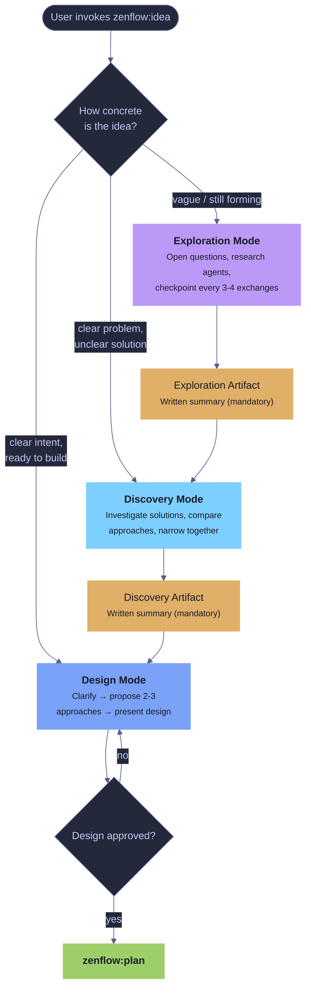
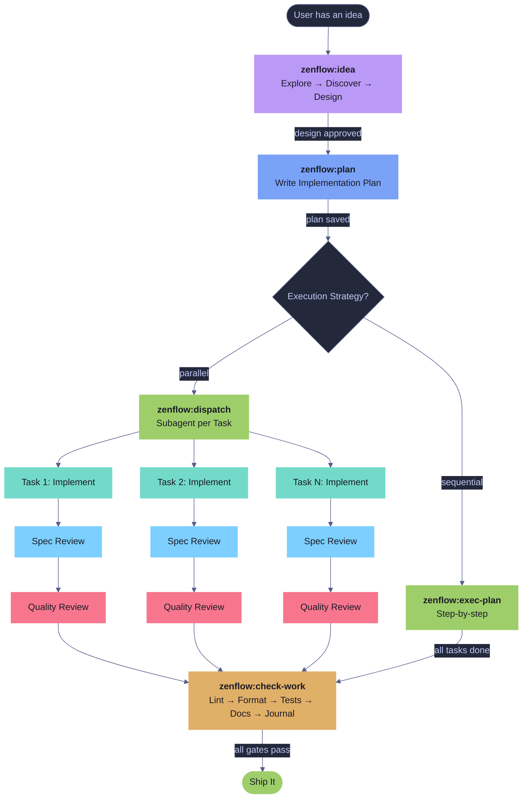
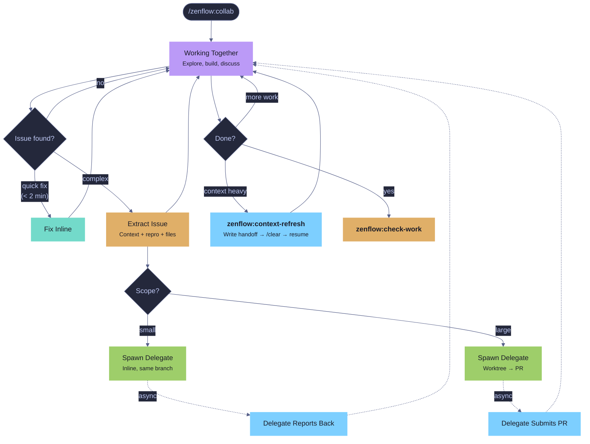

# Workflows & Diagrams

[Back to README](README.md)

## Navigation

**Diagrams**
- [zenflow:idea — Three Modes](#zenflowidea--three-modes)
- [Full Pipeline Flow](#full-pipeline-flow)
- [Bug Fix Pipeline](#bug-fix-pipeline)
- [Collab Session Flow](#collab-session-flow)
- [Context Refresh Flow](#context-refresh-flow)

**Examples**
- [New Feature (full pipeline)](#new-feature-full-pipeline)
- [Collab Session (inline delegation)](#collab-session-inline-delegation)
- [Collab Session (worktree delegation)](#collab-session-worktree-delegation)
- [Context Refresh (mid-session)](#context-refresh-mid-session)
- [Bug Fix](#bug-fix)
- [Documentation Update](#documentation-update)

---

## Workflow Diagrams

### zenflow:idea — Three Modes



### Full Pipeline Flow



### Bug Fix Pipeline


### Collab Session Flow



### Context Refresh Flow


---

## Workflow Examples

### New Feature (full pipeline)

```
You: /zenflow:idea  I want to improve how agents communicate results
  → "How concrete is this? Still forming, clear problem, or ready to design?"

You: Still forming — I know there's a problem but I'm not sure what to build
  → [Exploration mode: open questions, research agents investigate
     current communication patterns, checkpoint findings]
  → Exploration artifact produced

  → "This is getting concrete — ready to move into discovery?"
You: Yes
  → [Discovery mode: investigates 3 approaches — structured reports,
     streaming events, journal integration]
  → Discovery artifact produced: leading candidate is journal integration

  → "Ready to design?"
You: Yes, let's go with journal integration
  → [Design mode: clarifies schema, proposes architecture, presents design]
  → Design approved

You: /zenflow:plan
  → Plan saved to resources/plans/245-agent-communication.md

You: Subagent-Driven
  → /zenflow:dispatch executes 5 tasks with parallel subagents
  → Each task: implement → spec review → code quality review
  → /zenflow:check-work runs all 5 gates
  → Done
```

### Collab Session (inline delegation)

```
You: /zenflow:collab  Let's work on the notification system together
  → Starting collab session (Opus). Working on notifications together.

You: Let's start by looking at how SSE works in the server
  → [Reads SSE handler together, discusses architecture]
  → "The stream handler looks clean but I notice the rate limiter
     has a bug — it's not resetting the counter. Want to fix it
     inline or delegate?"

You: Delegate it, let's stay focused on notifications
  → [Extracts issue with context, reproduction steps, files involved]
  → [Spawns collab-delegate agent with full handoff]
  → Delegate:
      Loading project context...
        ✓ CLAUDE.md
      Loading .claude/rules/ ...
        ✓ error-handling.md
        ✓ async-patterns.md
        ✓ ... (all rules)
      Rules loaded: 13 files. Ready to work.
      [Writes regression test, fixes rate limiter]
  → "Rate limiter fix is in — added counter reset in middleware.
     Back to notifications..."
```

### Collab Session (worktree delegation)

```
You: /zenflow:collab  Let's explore the plugin system together
  → Starting collab session (Opus). Exploring plugins together.

You: I think the plugin loader needs a complete rewrite
  → [Reads plugin loader, discusses problems together]
  → "This is bigger than a side fix — 6 files involved, needs a plan.
     Want me to delegate this to a worktree so we can keep exploring?"

You: Yes, fire and forget — we'll review the PR later
  → [Extracts issue with full context and architectural notes]
  → [Spawns collab-delegate in isolated worktree]
  → "Delegate is working on its own branch. It'll plan the rewrite,
     implement it, and submit a PR. We'll review when it's ready.
     Back to exploring — what else did you want to look at?"

  → ... (20 minutes later, delegate finishes)
  → "The plugin loader PR is up: #247 — rewrites loader with
     lazy initialization, adds 12 tests. Review it when you're ready."

You: We'll look at it after we finish here
  → [Continues working, PR waiting for review]
```

### Context Refresh (mid-session)

```
You: /zenflow:collab  Let's work on the auth system together
  → Starting collab session (Opus).

  ... (2 hours of exploration, debugging, delegating)

Agent: "We've read a lot of files and gone through some debug tangents.
  Want to do a context refresh so we can continue with a clean slate?"

You: Good idea
  → "What should we call this session?"
You: auth-rewrite
  → Writing context refresh handoff...
  → Journal entry written (type: context-refresh)
  → Handoff saved to .claude/handoffs/auth-rewrite-2026-04-01T14:30:00Z.md
  → "Ready to clear. Run /clear, then re-invoke /zenflow:collab."

You: /clear

You: /zenflow:collab
  → Detected handoff: auth-rewrite (30 seconds ago)
  → Re-reading collab philosophy...
  → "Resuming session 'auth-rewrite'. Here's where we are:
     - Mapped the auth middleware chain, delegated session token fix to worktree
     - Decided on JWT rotation strategy with 15-min expiry
     - Next up: design the refresh token endpoint
     Does this match your understanding?"

You: Yes, let's continue
  → [Resumes from next steps with clean context]
```

### Bug Fix

```
You: /zenflow:bug-fix  SSE connections drop after 30 seconds
  → Reproduces the bug
  → Launches error-detective + error-coordinator in parallel
  → Detective: keep-alive interval missing in stream handler
  → Coordinator: no cascade risk, isolated to SSE module
  → Specialist writes regression test + minimal fix
  → Code reviewer approves
  → /zenflow:check-work validates
```

### Documentation Update

```
You: /zenflow:docs
  → Reads .claude/zen.local.md for doc paths
  → Scans docs/, finds 3 stale guides
  → "Which docs should I update?" → Guides + README
  → Updates with current behavior
```
