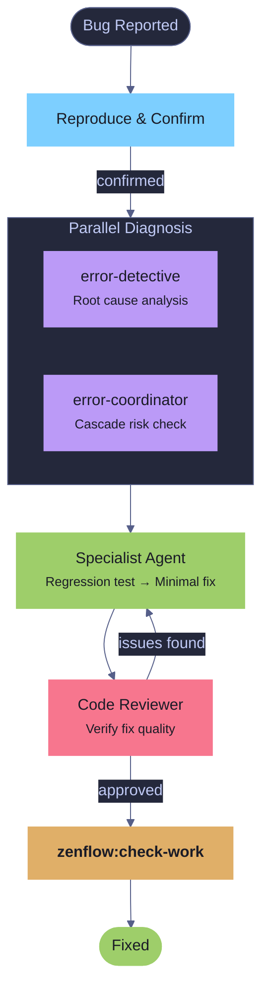
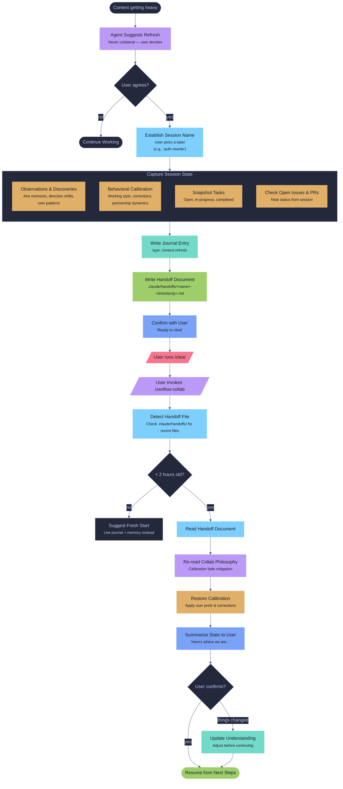

# Workflows & Diagrams

[Back to README](README.md)

## Navigation

**Diagrams**
- [3-Agent Issue-Driven Flow](#3-agent-issue-driven-flow)
- [zenflow:idea — Three Modes](#zenflowidea--three-modes)
- [Full Pipeline Flow](#full-pipeline-flow)
- [Bug Fix Pipeline](#bug-fix-pipeline)
- [Context Refresh Flow](#context-refresh-flow)

**Examples**
- [Issue-Driven Feature](#issue-driven-feature)
- [Builder Session](#builder-session)
- [Reviewer Session](#reviewer-session)
- [Context Refresh (mid-session)](#context-refresh-mid-session)
- [Bug Fix](#bug-fix)
- [Documentation Update](#documentation-update)

---

## Workflow Diagrams

### 3-Agent Issue-Driven Flow

```mermaid
%%{init: {'theme': 'base', 'themeVariables': { 'primaryColor': '#1a1b26', 'primaryTextColor': '#c0caf5', 'lineColor': '#565f89', 'secondaryColor': '#24283b', 'tertiaryColor': '#24283b' }}}%%
flowchart TD
    start([User + Collab Session]) --> explore
    explore["<b>Explore & Plan Together</b><br/><small>Research, spike, discuss</small>"]
    explore --> create["<b>Create GitHub Issue</b><br/><small>Context + ACs + Verification Instructions</small>"]
    create --> issue[("GitHub Issue #N")]

    issue --> userBuild([User launches /build #N])
    userBuild --> read["<b>Builder: Read Issue</b><br/><small>Confirm with user via AskUserQuestion</small>"]
    read --> branch["Create Branch"]
    branch --> implement["<b>Implement</b><br/><small>Every decision via AskUserQuestion</small>"]
    implement --> verify["<b>Local Verification</b><br/><small>Tests + lint + verification instructions</small>"]
    verify --> pr["<b>Open PR</b><br/><small>AC status + verification proof</small>"]
    pr --> prArtifact[("Pull Request")]

    prArtifact --> userReview([User launches /review #N])
    userReview --> diff["<b>Reviewer: Read Diff + Issue</b>"]
    diff --> checklist["<b>Run 5-Area Checklist</b><br/><small>Code quality, tests, PR body,<br/>runtime verification, patterns</small>"]
    checklist --> verdict{"Verdict?"}
    verdict -->|"Ship it"| approve["Approve PR"]
    verdict -->|"Needs work"| comment["Post Review Comment"]
    comment --> userBuild

    style start fill:#24283b,color:#c0caf5,stroke:#565f89
    style explore fill:#bb9af7,color:#1a1b26,stroke:#bb9af7
    style create fill:#bb9af7,color:#1a1b26,stroke:#bb9af7
    style issue fill:#e0af68,color:#1a1b26,stroke:#e0af68
    style userBuild fill:#24283b,color:#c0caf5,stroke:#565f89
    style read fill:#9ece6a,color:#1a1b26,stroke:#9ece6a
    style branch fill:#9ece6a,color:#1a1b26,stroke:#9ece6a
    style implement fill:#9ece6a,color:#1a1b26,stroke:#9ece6a
    style verify fill:#9ece6a,color:#1a1b26,stroke:#9ece6a
    style pr fill:#9ece6a,color:#1a1b26,stroke:#9ece6a
    style prArtifact fill:#e0af68,color:#1a1b26,stroke:#e0af68
    style userReview fill:#24283b,color:#c0caf5,stroke:#565f89
    style diff fill:#f7768e,color:#1a1b26,stroke:#f7768e
    style checklist fill:#f7768e,color:#1a1b26,stroke:#f7768e
    style verdict fill:#24283b,color:#c0caf5,stroke:#565f89
    style approve fill:#9ece6a,color:#1a1b26,stroke:#9ece6a
    style comment fill:#7dcfff,color:#1a1b26,stroke:#7dcfff
```



### zenflow:idea — Three Modes


### Full Pipeline Flow


### Bug Fix Pipeline



### Context Refresh Flow



---

## Workflow Examples

### Issue-Driven Feature

```
You: /zenflow:collab  Let's work on the notification system
  → Starting collab session (Opus). What are we trying to accomplish?

You: Users need to know when their builds finish
  → [Explores notification approaches together — SSE, polling, WebSocket]
  → [Spawns research agent to investigate existing SSE patterns in codebase]
  → "Based on what we found, SSE with a notification store makes sense.
     Let me draft an issue for the builder."

  → [Discusses acceptance criteria and verification instructions with user]
  → gh issue create #55 "Add SSE build notifications"
  → "Issue #55 created. When you're ready: /build #55"

You: (in a new session) /build #55
  → "Issue #55: Add SSE build notifications
     ACs: SSE endpoint, notification store, client subscription, UI badge
     Proceed?" → [User confirms]
  → [Creates branch, implements each AC, surfaces decisions via AskUserQuestion]
  → [Runs verification instructions, captures proof]
  → "PR #60 opened. Ready for review: /review #60"

You: (in a new session) /review #60
  → "How should I review?" → [User picks Independent]
  → [Reads diff, runs 5-area checklist]
  → [Launches Playwright verification — navigates to dashboard, triggers build,
     confirms notification badge appears]
  → Posts structured review comment: "Ship it — all ACs verified"
```

### Builder Session

```
You: /build #42
  → Reads issue #42: "Add user profile avatar upload"
  → "Issue #42: Add user profile avatar upload
     Brief: Allow users to upload an avatar image from the profile settings page.
     AC groups: Backend API, Frontend UI, Validation, Storage
     Proceed?"
  → [User confirms]

  → Loading project context...
    ✓ CLAUDE.md
    ✓ .claude/rules/api-patterns.md
    ✓ .claude/rules/react-conventions.md
    Rules loaded: 5 files.

  → [Implements Backend API ACs]
  → "For file storage, I see two options:"
    AskUserQuestion: Local disk vs S3?
  → [User picks S3]
  → [Implements remaining ACs, runs tests, runs verification instructions]
  → PR #48 opened. Acceptance criteria: 8/8 completed.
```

### Reviewer Session

```
You: /review #48
  → "How should I review this PR?" → [Independent]
  → Reading PR #48: "Add user profile avatar upload" (Closes #42)
  → Reading diff: +342 -12, 6 files changed
  → Reading linked issue #42 for acceptance criteria

  → Running checklist...
  → [Launches Playwright verification — uploads test avatar, confirms display]
  → [Checks code quality, test coverage, PR body integrity]

  → Posts review comment:
    ## Code Review
    ### Overview
    Adds avatar upload with S3 storage, input validation, and profile UI.
    ### Strengths
    - Clean multipart handling with size/type validation
    - Good test coverage (12 new tests)
    ### Issues & Suggestions
    **1. Missing Content-Type validation on S3 upload** — load-bearing
    The S3 put uses the client-provided content-type without server-side
    verification. Should validate against allowed MIME types.
    ### Runtime Verification
    ✅ Upload flow works end-to-end (screenshot attached)
    ✅ Oversized file rejected with correct error
    ### Verdict
    Approve-with-nits — fix the Content-Type validation in a follow-up commit.
```

### Context Refresh (mid-session)

```
You: /zenflow:collab  Let's work on the auth system together
  → Starting collab session (Opus).

  ... (2 hours of exploration, debugging, delegating)

Agent: "We've read a lot of files and gone through some debug tangents.
  Want to do a context refresh so we can continue with a clean slate?"

You: Good idea
  → "What should we call this session?"
You: auth-rewrite
  → Writing context refresh handoff...
  → Journal entry written (type: context-refresh)
  → Handoff saved to .claude/handoffs/auth-rewrite-2026-04-01T14:30:00Z.md
  → "Ready to clear. Run /clear, then re-invoke /zenflow:collab."

You: /clear

You: /zenflow:collab
  → Detected handoff: auth-rewrite (30 seconds ago)
  → Re-reading collab philosophy...
  → "Resuming session 'auth-rewrite'. Here's where we are:
     - Mapped the auth middleware chain, created issue #58 for session token fix
     - Decided on JWT rotation strategy with 15-min expiry
     - Next up: design the refresh token endpoint
     Does this match your understanding?"

You: Yes, let's continue
  → [Resumes from next steps with clean context]
```

### Bug Fix

```
You: /zenflow:bug-fix  SSE connections drop after 30 seconds
  → Reproduces the bug
  → Launches error-detective + error-coordinator in parallel
  → Detective: keep-alive interval missing in stream handler
  → Coordinator: no cascade risk, isolated to SSE module
  → Specialist writes regression test + minimal fix
  → Code reviewer approves
  → /zenflow:check-work validates
```

### Documentation Update

```
You: /zenflow:docs
  → Reads .claude/zen.local.md for doc paths
  → Scans docs/, finds 3 stale guides
  → "Which docs should I update?" → Guides + README
  → Updates with current behavior
```
